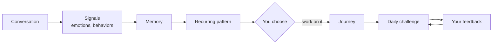
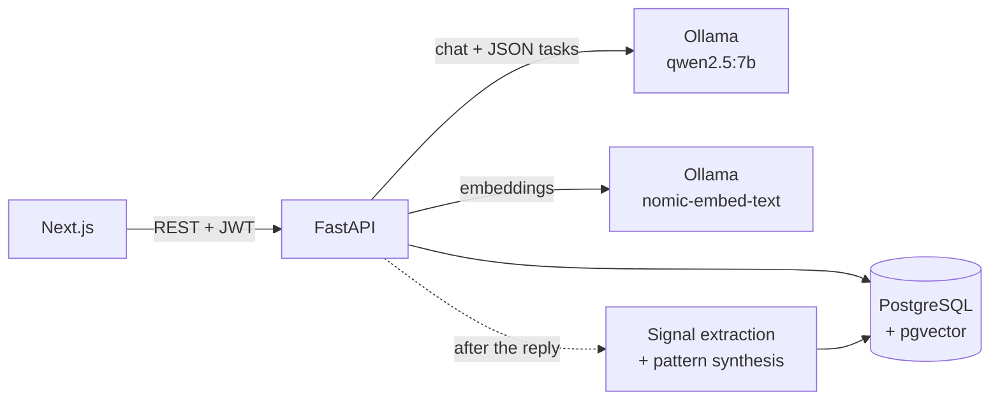
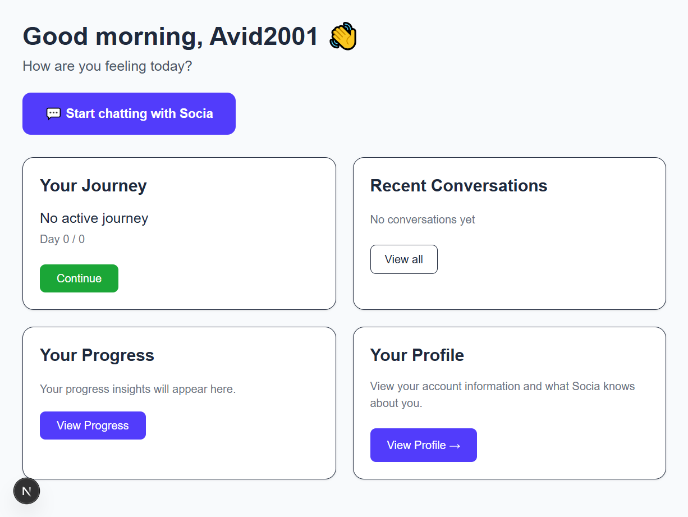
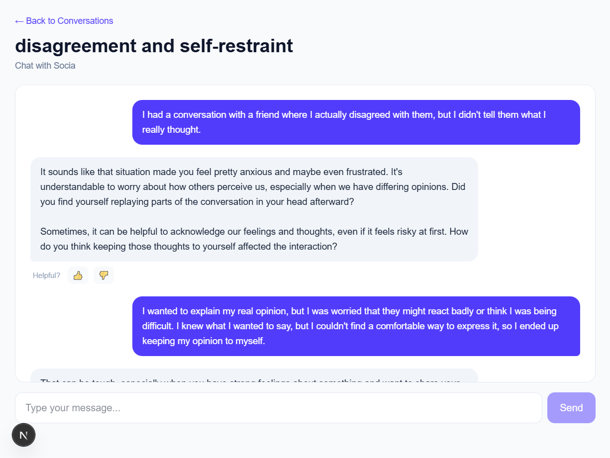
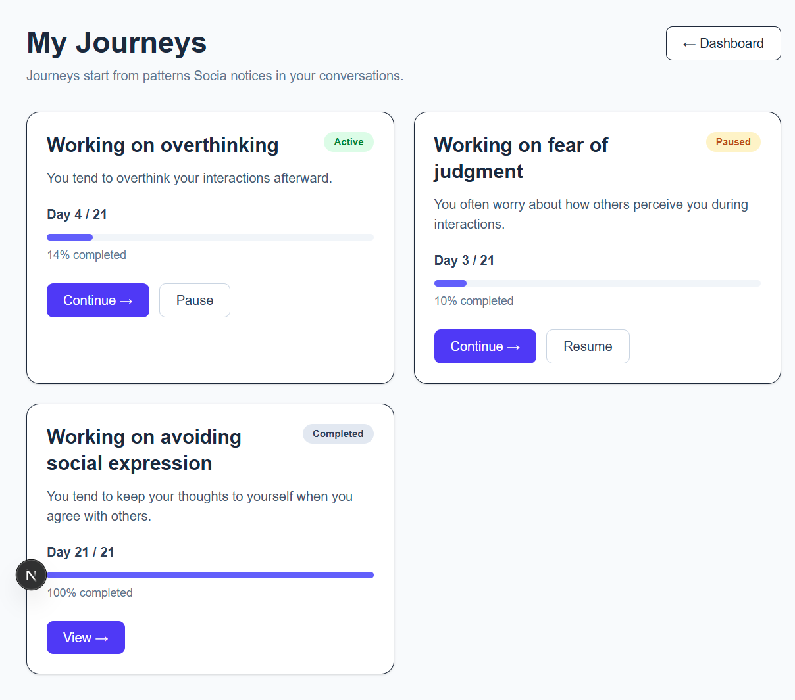
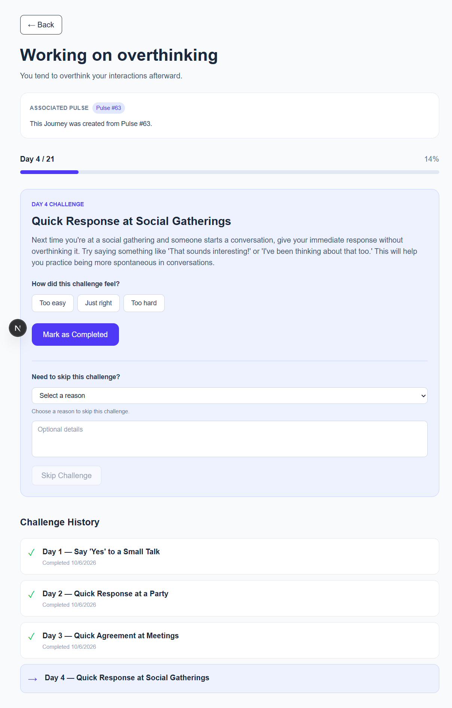
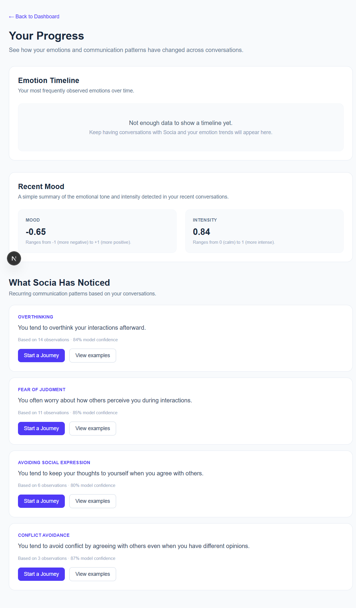
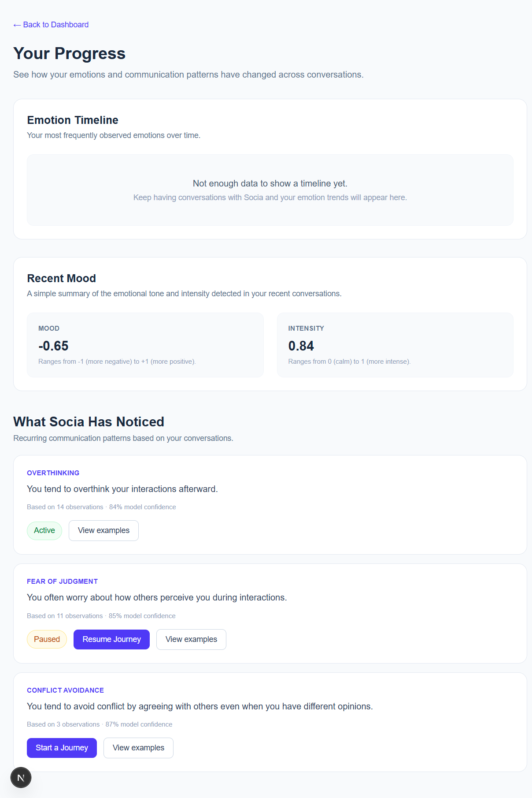

# Socia

**A local-LLM companion that remembers, notices recurring communication patterns, and turns the ones you choose into adaptive multi-day Journeys.**

## Why Socia?

Social interaction is a part of everyday life, but it is not equally easy for everyone. Some people struggle with social anxiety, low confidence, overthinking, fear of judgment, difficulty expressing themselves, conflict avoidance, or simply not knowing how to handle certain social situations. These difficulties can show up repeatedly in everyday conversations, relationships, presentations, work, or other social situations.

There are already products that address parts of this problem, but they often take different approaches. Some are closer to **structured or clinically oriented mental-wellbeing tools**, such as Wysa, which provides guided self-help and clinically backed support. Others are designed primarily as **AI companions**, such as Replika, where the emphasis is on ongoing conversation and companionship. These approaches serve different purposes, but they leave an interesting space between them: a conversational companion that can provide support and guidance while also paying attention to recurring patterns in the user's own interactions and helping them practice concrete changes over time.

**Socia was built to explore that space.**

The idea is not to make an AI that diagnoses a user or decides what is wrong with them. Instead, Socia combines the conversational and supportive aspects of an AI companion with a longitudinal memory and practice loop:

**listen → remember → notice → let the user choose → practice → adapt**

The system observes signals from conversations, keeps relevant moments as memory, and can surface repeated behavioral signals as candidate patterns. If the user considers a pattern meaningful, they can choose to work on it through a multi-day Journey. The Journey then turns the selected pattern into small, concrete challenges and adapts the next challenge based on the user's feedback.

### From conversation to practice

A typical Socia interaction works roughly like this:

1. **Conversation** — The user talks to the companion about whatever is happening in their life.
2. **Signal extraction** — The conversation is analyzed for structured signals such as emotions, behavior observations, and entities.
3. **Memory** — Relevant observations are stored as episodic memories and can later be retrieved when they are useful.
4. **Pattern synthesis** — Repeated observations can be promoted into a synthesized behavioral pattern. In the current prototype, this is a deterministic counting rule rather than a trained behavioral detector.
5. **User choice** — A detected pattern is not treated as a fact about the user or something they must work on. The user decides whether to start a Journey from it.
6. **Journey** — The selected pattern becomes the focus of a multi-day process with small challenges.
7. **Feedback and adaptation** — The user can rate a challenge, explain how it felt, or skip it and provide a reason. The next challenge is generated using that feedback.

In other words, Socia is designed to move beyond **"talk to an AI"** toward **"talk, build continuity, notice possible patterns, and practice what you choose to change."**

## How the behavioral detection evolves

The current production prototype uses a simple approach:

**Conversation history → LLM signal extraction → deterministic counting rule → synthesized pattern**

This keeps the current product implementation understandable and testable, but it is also intentionally limited. A pattern is currently promoted when the same behavior observation reaches the application's threshold of three observations. There is no temporal recurrence model, decay, or learned detector, and detection quality has not yet been measured.

The `ml/` research module explores a future version of this component:

**Conversation history → structured temporal events → ML recurrence detector → pattern/evidence layer → user-controlled Journey**

The research question is whether recurring behavioral patterns can be learned from the **temporal structure of signals extracted from conversation history**, rather than identifying recurrence only through a fixed observation count.

This research module is currently evaluated on a controlled synthetic longitudinal benchmark. It is separate from the running Production system and is not presented as a validated detector of real-world human behavior.

## What Socia is

Socia is therefore both:

* a **working full-stack AI companion prototype**, exploring persistent memory, personalization, adaptive interaction, and user-controlled behavioral reflection; and
* a **research project**, investigating temporal modeling of recurring patterns as a possible future replacement or augmentation of the current deterministic pattern-promotion mechanism.

The production system and research module are intentionally separated so that experimental ML results do not become implicit claims about what the current product can reliably detect.

> **Status: working prototype (v0.1). Not a clinical or therapeutic tool.** Production pattern detection currently uses LLM signal extraction followed by a deterministic counting rule, and its detection quality has not been measured. The ML module in `ml/` is a separate research module and is **not part of the running product**.

## What Socia does



1. **Talk.** Chat with a companion personalized by what it has learned about you. Its tone softens or sharpens based on your feedback.
2. **It notices.** Each message is analyzed in the background for emotions, behavior tags and entities. A behavior observed at least three times can be promoted to a pattern, linked to the moments that support it.
3. **You decide.** Patterns are offered, never imposed. Start a Journey from one, or don't.
4. **Practice.** A 14–30 day Journey serves one small challenge at a time. Rate it, describe how it felt, or skip it and say why. The next challenge is written in response.

## Architecture at a glance



Each chat turn: **safety check → routing → memory retrieval → reply → consistency check → response**. Analysis is scheduled after the response path rather than being part of the main reply generation flow.

## Key engineering decisions

* **The LLM handles language; code handles guarantees.** Self-harm routing, output validation, pattern promotion, pacing and authorization are deterministic. The model extracts signals from individual messages; application logic determines when repeated signals are promoted to a pattern. *Trade-off: predictable and testable, but only as good as the tagging, which is unmeasured.*
* **Model output is untrusted.** Extraction is validated against closed vocabularies in Python and again by database `CHECK` constraints. One bad item is dropped without discarding the rest of the message.
* **Memory with provenance.** Episodic moments (embedded, retrieved by cosine distance with a cutoff and one hit per message) are kept separate from synthesized patterns. Each pattern links to its evidence and every revision is versioned. The prompt tells the model that a single moment is not a trait.
* **Adaptation inside the loop, not a fixed plan.** Challenges are generated one at a time from the previous outcome, using bounded feedback (difficulty, skip reason) plus free text. *Trade-off: it only looks one step back.*
* **Local inference.** LLM and embedding inference run locally through Ollama rather than through a hosted model API. *Trade-off: a 7B model is less reliable at structured output, which is why the validation above exists.*

## Pattern detection roadmap

The current Production prototype uses **LLM-based signal extraction followed by deterministic application logic** to identify repeated behavioral signals. This is an intentionally simple baseline rather than the final behavioral detection system.

The separate `ml/` research module is being developed as the next-stage behavioral pattern detector. Its goal is to learn recurring behavioral patterns from temporal event sequences rather than relying on a fixed counting rule.

Once the research model is sufficiently validated, the intended architecture is to replace or augment the current deterministic pattern-promotion step with the ML behavioral detector, while keeping the surrounding Production components—memory, evidence tracking, Journeys, safety, and user control—separate from the detector itself.

**Current:** LLM signal extraction → deterministic recurrence rule

**Planned:** LLM signal extraction → ML behavioral pattern detector → pattern/evidence layer → user-controlled Journeys

## Current limitations

* Detection quality is unmeasured, and "recurring" means a count of 3 with no time window.
* There is currently no user-facing way to dismiss or correct a detected pattern.
* The current self-harm safety mechanism is a keyword-based check applied to chat messages; it is not a comprehensive safety classifier. There is currently no in-app safety disclaimer ([`SAFETY.md`](docs/SAFETY.md)).
* Background analysis runs in-process with no retry.

The full implemented / partial / missing matrix and known issues are in [`docs/status.md`](docs/status.md).

## Research module (separate)

`ml/` studies whether a model can detect *recurrent* behavioral patterns rather than timing shortcuts, using a synthetic benchmark. It is under validation, reports, and will be integrated only after passing defined gates. See [`ml/`](ml/README.md).

## Tech stack

Next.js (App Router) · TypeScript · Recharts · FastAPI · SQLAlchemy · Pydantic · PostgreSQL + pgvector · Ollama (`qwen2.5:7b`, `nomic-embed-text`) · JWT auth

## Run it locally

Requires Python, Node.js, PostgreSQL with the `pgvector` extension, and [Ollama](https://ollama.com/).

```bash
ollama pull qwen2.5:7b && ollama pull nomic-embed-text
uvicorn app.main:app --reload --port 8000     # backend (configure .env first)
cd frontend && npm install && npm run dev     # http://localhost:3000
```

Complete setup, environment variables and a demo script: [`docs/development.md`](docs/development.md).

## Go deeper

[Architecture](docs/architecture.md) · [Memory & patterns](docs/memory-and-patterns.md) · [Journeys](docs/journeys.md) · [Safety](docs/SAFETY.md) · [Concepts](docs/concepts.md) · [Status](docs/status.md) · [ML (Research)](ml/README.md)

## Screenshots

## Screenshots

<div align="center">
  
  
  
</div>

<div align="center">
  
  
  
</div>


