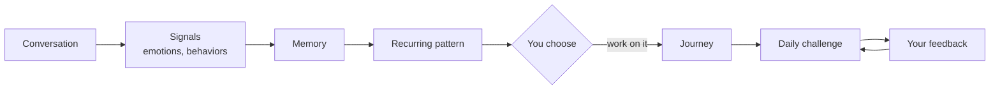
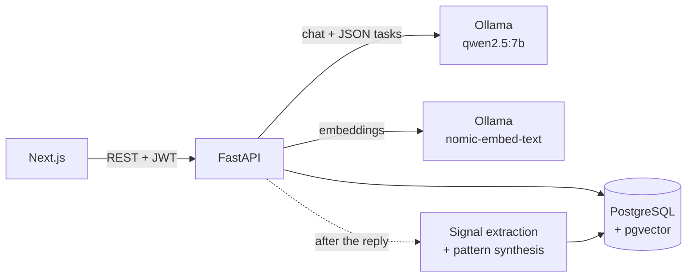

# Socia

**A local-LLM companion that remembers, notices recurring communication patterns, and turns the ones you choose into adaptive multi-day Journeys.**

Built for people who find social communication hard. A full-stack system: FastAPI, PostgreSQL + pgvector, Next.js, and a self-hosted Qwen2.5-7B.

> **Status: working prototype (v0.1). Not a clinical or therapeutic tool.** Pattern detection today is *LLM signal extraction + a deterministic counting rule*, and its accuracy has not been measured. The ML detector in `ml/` is a separate research module, under validation and **not** part of the running product. Details: [`docs/status.md`](docs/status.md).

## What Socia does



1. **Talk.** Chat with a companion personalized by what it has learned about you. Its tone softens or sharpens based on your feedback.
2. **It notices.** Each message is analyzed in the background for emotions, behavior tags and entities. A behavior observed at least three times can be promoted to a pattern, linked to the moments that support it.
3. **You decide.** Patterns are offered, never imposed. Start a Journey from one, or don't.
4. **Practice.** A 14–30 day Journey serves one small challenge at a time. Rate it, describe how it felt, or skip it and say why. The next challenge is written in response.

## Architecture at a glance



Each chat turn: **safety check → routing → memory retrieval → reply → consistency check → response**. Analysis is scheduled after the response path rather than being part of the main reply generation flow.

## Key engineering decisions

* **The LLM handles language; code handles guarantees.** Self-harm routing, output validation, pattern promotion, pacing and authorization are deterministic. The model extracts signals from individual messages; application logic determines when repeated signals are promoted to a pattern. *Trade-off: predictable and testable, but only as good as the tagging, which is unmeasured.*
* **Model output is untrusted.** Extraction is validated against closed vocabularies in Python and again by database `CHECK` constraints. One bad item is dropped without discarding the rest of the message.
* **Memory with provenance.** Episodic moments (embedded, retrieved by cosine distance with a cutoff and one hit per message) are kept separate from synthesized patterns. Each pattern links to its evidence and every revision is versioned. The prompt tells the model that a single moment is not a trait.
* **Adaptation inside the loop, not a fixed plan.** Challenges are generated one at a time from the previous outcome, using bounded feedback (difficulty, skip reason) plus free text. *Trade-off: it only looks one step back.*
* **Local inference.** LLM and embedding inference run locally through Ollama rather than through a hosted model API. *Trade-off: a 7B model is less reliable at structured output, which is why the validation above exists.*


## Pattern detection roadmap

The current Production prototype uses **LLM-based signal extraction followed by deterministic application logic** to identify repeated behavioral signals. This is an intentionally simple baseline rather than the final behavioral detection system.

The separate `ml/` research module is being developed as the next-stage behavioral pattern detector. Its goal is to learn recurring behavioral patterns from temporal event sequences rather than relying on a fixed counting rule.

Once the research model is sufficiently validated, the intended architecture is to replace or augment the current deterministic pattern-promotion step with the ML behavioral detector, while keeping the surrounding Production components—memory, evidence tracking, Journeys, safety, and user control—separate from the detector itself.

**Current:** LLM signal extraction → deterministic recurrence rule
**Planned:** LLM signal extraction → ML behavioral pattern detector → pattern/evidence layer → user-controlled Journeys

## Current limitations

* Detection quality is unmeasured, and "recurring" means a count of 3 with no time window.
* There is currently no user-facing way to dismiss or correct a detected pattern.
* The current self-harm safety mechanism is a keyword-based check applied to chat messages; it is not a comprehensive safety classifier. There is currently no in-app safety disclaimer ([`SAFETY.md`](docs/SAFETY.md)).
* Background analysis runs in-process with no retry.

The full implemented / partial / missing matrix and known issues are in [`docs/status.md`](docs/status.md).

## Research module (separate)

`ml/` studies whether a model can detect *recurrent* behavioral patterns rather than timing shortcuts, using a synthetic benchmark. It is under validation, reports, and will be integrated only after passing defined gates. See [`ml/`](ml/README.md).

## Tech stack

Next.js (App Router) · TypeScript · Recharts · FastAPI · SQLAlchemy · Pydantic · PostgreSQL + pgvector · Ollama (`qwen2.5:7b`, `nomic-embed-text`) · JWT auth

## Run it locally

Requires Python, Node.js, PostgreSQL with the `pgvector` extension, and [Ollama](https://ollama.com/).

```bash
ollama pull qwen2.5:7b && ollama pull nomic-embed-text
uvicorn app.main:app --reload --port 8000     # backend (configure .env first)
cd frontend && npm install && npm run dev     # http://localhost:3000
```

Complete setup, environment variables and a demo script: [`docs/development.md`](docs/development.md).

## Go deeper

[Architecture](docs/architecture.md) · [Memory & patterns](docs/memory-and-patterns.md) · [Journeys](docs/journeys.md) · [Safety](docs/SAFETY.md) · [Concepts](docs/concepts.md) · [Status](docs/status.md) · [ML(Research)](ml/README.md)


