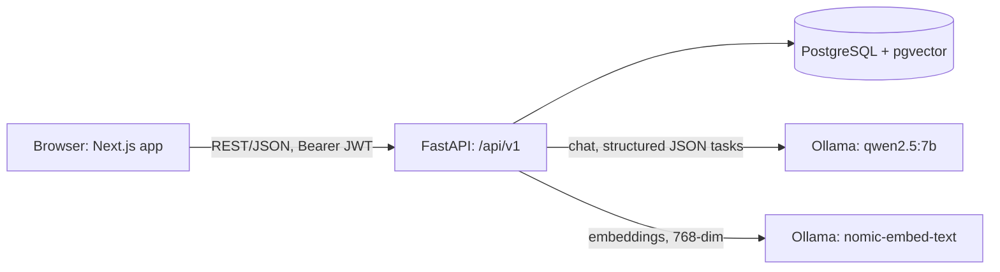
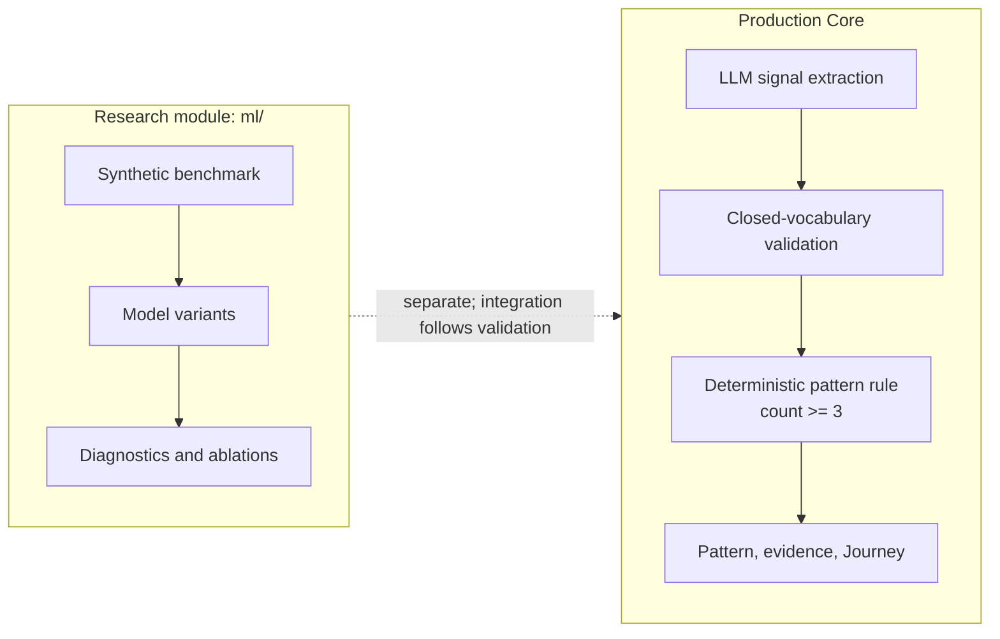
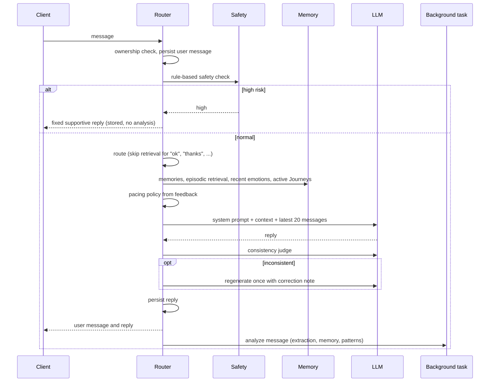
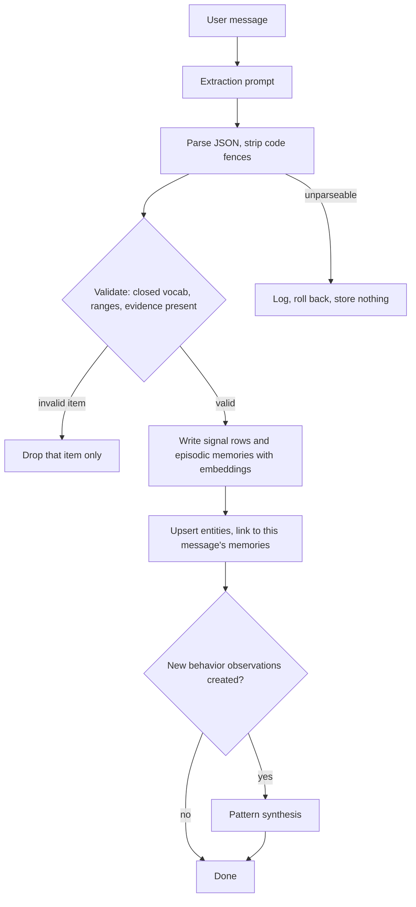
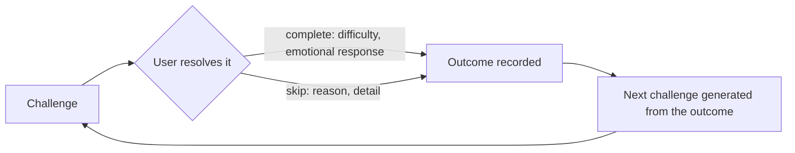
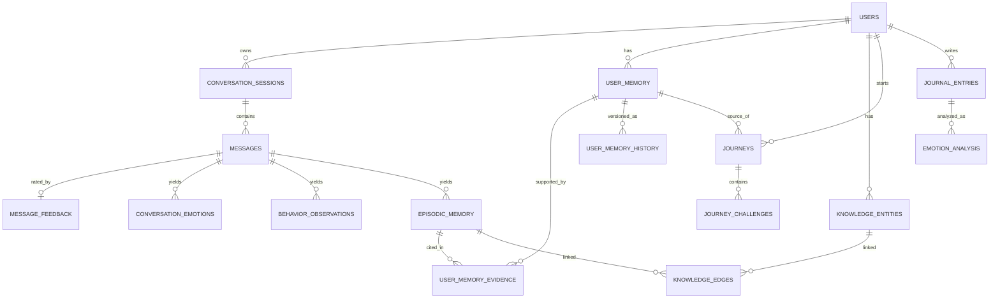

# Architecture

Socia is a **local-first, memory-augmented AI companion with deterministic application safeguards and a separate experimental behavioral-ML layer.**

A layered FastAPI backend combines a locally hosted LLM (Qwen2.5-7B via Ollama) with structured signal extraction, two-tier memory backed by pgvector, traceable behavioral patterns, and user-controlled Journeys. The model is primarily responsible for language generation and structured signal extraction, while deterministic application logic handles safety routing, validation, authorization, and pattern promotion. The `ml/` research module is developed and evaluated independently and is **not currently part of the production pipeline**.

Implementation status (what is complete, partial, or planned) is tracked in [`status.md`](status.md).

## Design principles

1. **LLM for language, deterministic logic for critical decisions.** The model generates replies, extracts signals under a fixed schema, and phrases behavioral descriptions. Safety routing, output validation, pattern promotion, pacing, and authorization are handled by deterministic application logic.
2. **Model output is validated before entering the data layer.** Emotions, behavior tags, and entity types use small closed vocabularies that are checked in Python and reinforced by database `CHECK` constraints.
3. **Derived insights remain traceable.** A synthesized pattern links to the episodic moments that support it, while revisions are preserved through version history.
4. **The user remains in control.** Behavioral patterns are presented as actionable observations rather than imposed conclusions, and Journeys begin only through an explicit user action.
5. **Local-first inference.** Chat, extraction, and embeddings run through locally hosted models rather than a third-party LLM API ([ADR-0001](decisions/0001-local-llm.md)).
6. **Production and research are separated.** The Production core operates independently of the experimental ML module, allowing the research detector to be evaluated before it is considered for integration ([ADR-0004](decisions/0004-ml-detector-deferred.md)).

## System overview

### Backend layers

| Layer            | Path                          | Responsibility                                                                                                               |
| ---------------- | ----------------------------- | ---------------------------------------------------------------------------------------------------------------------------- |
| Routers          | `app/api/`                    | HTTP handling, validation, ownership checks, and request orchestration                                                       |
| Services         | `app/services/`               | Business logic for safety, routing, context assembly, memory, patterns, reflection, Journeys, personalization, and analytics |
| AI adapter       | `app/ai/ollama.py`            | Centralized model communication and prompt construction                                                                      |
| Models / schemas | `app/models/`, `app/schemas/` | SQLAlchemy data models, database constraints, and Pydantic contracts                                                         |
| Config           | `app/core/`                   | Application settings, logging, and onboarding configuration                                                                  |

Routers remain relatively thin, while services own application logic and model communication is centralized through a dedicated adapter. This keeps transport, business rules, and model interaction clearly separated.

## Production and research separation

* **Production** currently detects behavioral patterns through LLM-based signal extraction followed by a deterministic recurrence/counting rule. It has no runtime dependency on `ml/`.
* **`ml/`** is a research-only component for studying behavioral-pattern detection on a synthetic temporal benchmark. It is not called by the backend, and its experimental results do not currently affect Production behavior.
* Integration is a future step that depends on research validation. The intended architecture is described in [`research/README.md`](research/README.md).

## Responsibility split: LLM vs deterministic logic

| Step                                                                | Mechanism                                             |
| ------------------------------------------------------------------- | ----------------------------------------------------- |
| Self-harm detection                                                 | Deterministic rule-based check                        |
| Transactional-message routing                                       | Deterministic exact-match set                         |
| Context assembly (memories, recent emotions, active Journey titles) | Deterministic SQL                                     |
| Episodic retrieval                                                  | Embedding model plus deterministic cutoff and ranking |
| Reply generation                                                    | LLM                                                   |
| Reply consistency check                                             | LLM judge, with at most one regeneration              |
| Signal extraction (emotions, tags, entities)                        | LLM followed by deterministic validation              |
| **Pattern promotion (`count >= 3`)**                                | **Deterministic**                                     |
| Pattern description                                                 | LLM-generated supportive sentence                     |
| Displayed pattern confidence                                        | Deterministic mean of extraction confidence values    |
| Pacing policy (gentle / direct / standard)                          | Deterministic, based on feedback                      |
| Journey length (14–30 days)                                         | LLM proposal followed by deterministic clamping       |
| Challenge text                                                      | LLM, conditioned on the previous outcome              |
| Authorization                                                       | Deterministic                                         |

This separation limits the role of model-generated output in critical application decisions: the LLM contributes language and structured signals, while application logic determines how those outputs are validated, stored, and acted upon.

## Chat request lifecycle

`POST /api/v1/conversation/{session_id}/messages`

### Design notes

* **Safety-first routing.** The rule-based safety check runs before model generation. A high-risk match short-circuits the normal pipeline, stores the turn, and skips downstream analysis.
* **Bounded context.** The model receives the system prompt, assembled memory context, and the latest 20 messages from the conversation.
* **Selective retrieval.** Trivial messages can bypass episodic retrieval and additional emotion/Journey context, while synthesized memories remain available.
* **Reply consistency check.** An LLM judge checks the generated reply against available user context and can request one regeneration with a correction note. If the check itself is unavailable, the generated reply can still be returned.
* **Fast response path.** Reply generation is synchronous, while behavioral analysis runs afterwards so analysis does not become part of the interactive response path.
* **Durable input.** The user message is persisted before model generation.

## Memory architecture

| Tier               | Storage                                               | Used for                                                  |
| ------------------ | ----------------------------------------------------- | --------------------------------------------------------- |
| Working context    | Latest 20 messages plus assembled context             | Grounding the current reply                               |
| Episodic memory    | `episodic_memory` with `vector(768)` embeddings       | Similarity retrieval and the evidence pool for patterns   |
| Synthesized memory | `user_memory` with evidence links and version history | Stable user context and the objects presented as patterns |

Retrieval embeds the incoming message, ranks candidates by cosine distance, applies a distance cutoff, keeps the closest hit per source message so that a single long message cannot dominate retrieval, and returns the top results. If query embedding is unavailable, the system falls back to recent memories.

The chat prompt distinguishes synthesized patterns from episodic items: synthesized memories represent accumulated observations, while episodic memories represent individual moments. This separation helps keep a single conversational event from being treated as an established behavioral pattern.

Full details: [`memory-and-patterns.md`](memory-and-patterns.md).

## Behavioral signal pipeline

Behavioral analysis runs after the response is sent through FastAPI `BackgroundTasks`, keeping the current deployment as a single service.

* **Item-level tolerance.** An invalid extracted item can be discarded without discarding other valid items from the same message. Out-of-range valence or arousal values become `NULL` without discarding the corresponding emotion.
* **Defense in depth.** Closed vocabularies are enforced in Python and reinforced through database `CHECK` constraints.
* **Atomic handling of malformed output.** If the extraction cannot be parsed, the extraction transaction is rolled back so malformed data does not enter memory.
* **Dual representation.** Extracted signals are stored in typed tables (`conversation_emotions`, `behavior_observations`) for structured analysis and in `episodic_memory` for retrieval and evidence tracking.
* **Evidence-driven triggering.** Pattern synthesis runs when the current analysis creates new behavior observations.

## Traceable behavioral patterns

Production pattern promotion currently uses a deterministic rule: when a behavior tag reaches at least three qualifying occurrences, it can become a synthesized `pattern` memory. The LLM is used to phrase the resulting description rather than to make the promotion decision.

* **Evidence links.** Each pattern is linked to the episodic moments that support it.
* **Versioning.** Revisions snapshot the previous state into `user_memory_history`, while `evidence_count`, `confidence`, and `version` are tracked.
* **Traceability.** The underlying evidence can be followed from a synthesized pattern back to the episodic records that contributed to it.

The Production detector is therefore a deterministic baseline operating on LLM-extracted behavioral signals. The separate research module explores learned approaches to temporal behavioral-pattern detection; see [Production and research separation](#production-and-research-separation).

## User-controlled Journeys

A Journey is a 14–30 day process for working on one detected pattern or a user-stated goal. Starting a Journey requires an explicit user action.

* **Progressive generation.** Challenges are generated one at a time so that the next challenge can incorporate the previous outcome.
* **Structured feedback.** Difficulty (`too_easy`, `just_right`, `too_hard`), skip reason, and free-text emotional response are validated through Pydantic and database constraints.
* **Transactional transitions.** Journey advancement is atomic: if challenge generation fails, the state transition is rolled back.
* **Feedback-informed interaction.** A deterministic pacing policy uses recent ratings and challenge feedback to adjust the chat communication style.

Details: [`journeys.md`](journeys.md).

## Safety, privacy and authorization

* **Deterministic safety routing.** Self-harm detection uses a rule-based check before model generation and returns a fixed supportive response when triggered.
* **Authorization.** Data access is scoped by `user_id`, with explicit ownership checks for conversation and journal resources.
* **Local inference.** Conversation processing uses locally hosted models rather than a third-party LLM API.
* **Log hygiene.** User message content is not written to application logs.
* **Bounded model influence.** Closed vocabularies, schema validation, and database constraints limit how model-generated structured output can affect persisted application state.
* **Product positioning.** Socia is designed as a self-reflection and practice companion rather than a therapeutic or clinical tool.

Safeguards, scope, and known gaps: [`SAFETY.md`](SAFETY.md).

## Data model

| Table                                    | Role                                                                                                                       |
| ---------------------------------------- | -------------------------------------------------------------------------------------------------------------------------- |
| `episodic_memory`                        | One row per extracted emotion or behavior, with text, confidence, importance, and `vector(768)` embedding                  |
| `user_memory`                            | Synthesized memory: `pattern`, `emotion_pattern`, `preference`, or `insight`, with evidence count, confidence, and version |
| `user_memory_evidence`                   | Links synthesized memories to the episodic records that support them                                                       |
| `user_memory_history`                    | Stores previous versions of synthesized memories                                                                           |
| `knowledge_entities` / `knowledge_edges` | Per-user entities and message-level relationships                                                                          |
| `journeys` / `journey_challenges`        | Journey state, challenges, and per-challenge feedback                                                                      |
| `journal_entries` / `emotion_analysis`   | Standalone journaling and emotion-analysis data                                                                            |

## Resilience and failure handling

| Situation                              | System behavior                                                  |
| -------------------------------------- | ---------------------------------------------------------------- |
| Model unavailable during chat          | Returns HTTP 502 after the user message has been persisted       |
| Embedding unavailable during write     | Stores the memory without an embedding                           |
| Embedding unavailable during retrieval | Falls back to recent episodic memories                           |
| Invalid extraction output              | Rejects the malformed extraction without persisting partial data |
| Consistency check unavailable          | Returns the generated reply without blocking the response        |
| Journey generation fails               | Rolls back the Journey state transition                          |
| Onboarding generation unavailable      | Uses deterministic fallback text                                 |

## Frontend

The Next.js App Router provides:

* `login` and `register` for authentication
* `onboarding` for initial setup
* `dashboard` for the main user experience
* `conversations` and `conversations/[id]` for conversation history
* `chat` for interactive conversations with per-message helpful / not-helpful feedback
* `progress` for emotion trends, behavioral patterns, related entities, and Journey entry points
* `journeys` and `journeys/[id]` for challenge progression and feedback
* `profile` for user settings

API requests go through a shared `apiFetch` helper.

## Configuration

Application settings are environment-driven, including database configuration, JWT settings, chat and embedding model names, the Ollama URL, and the CORS origin.

See [`development.md`](development.md).

## Key trade-offs

* **Local 7B model vs hosted API.** Local inference keeps conversation processing on the user's own environment and avoids dependence on a hosted LLM API. The trade-off is that model-generated structured output requires explicit schema validation and application-level safeguards.
* **Deterministic promotion vs learned detection.** The current counting rule provides a simple, explainable, and testable Production baseline. The research module investigates whether a learned temporal detector can capture recurrence patterns beyond this baseline.
* **In-process background tasks vs a job queue.** FastAPI `BackgroundTasks` keeps the current deployment as a single service without introducing queue infrastructure. A dedicated job system remains a possible future evolution if background workload requirements grow.

Current gaps and planned work: [`status.md`](status.md).
