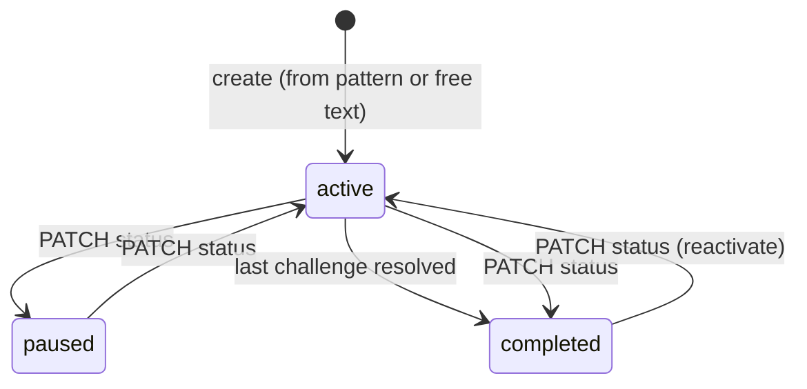
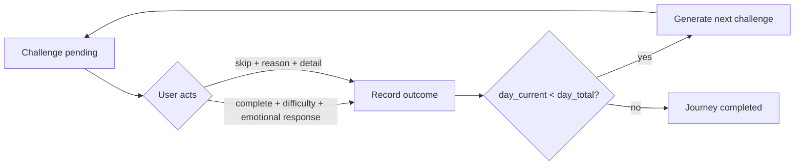

# Journeys, feedback and adaptation

A **Journey** is an ongoing process for working on a synthesized pattern or a user-stated goal. Challenges are generated one at a time, allowing each new challenge to take the outcome of the previous one into account.

## Lifecycle

Journeys can be created through `POST /journeys/from-pattern` or `POST /journeys/`.

Creation works as follows:

1. Assemble user context, including synthesized memories, recent emotions, and active Journey titles.
2. Ask the LLM to suggest a Journey length, then clamp the value to **14–30 days** in application code.
3. Persist the Journey with `source = ai_suggested` when created from a pattern, or `user_created` when created from free text.
4. Generate and persist the first challenge with status `pending`.

When created from a pattern, the Journey title is `Working on <tag with spaces>` and its description is the pattern's synthesized sentence. `source_memory_id` records the pattern that initiated the Journey.

## Challenge loop

A Journey's **day** is a sequence index rather than a calendar date. The next challenge is generated when the current challenge is resolved; there is currently no scheduling or calendar-based gating.

## Feedback captured

| Field                 | Values                                                                                                                  | Stored on          |
| --------------------- | ----------------------------------------------------------------------------------------------------------------------- | ------------------ |
| `difficulty_feedback` | `too_easy`, `just_right`, `too_hard`                                                                                    | challenge          |
| `emotional_response`  | free text                                                                                                               | challenge          |
| `skip_reason`         | `busy`, `forgot`, `too_difficult`, `too_anxious`, `not_relevant`, `disliked_activity`, `situation_unavailable`, `other` | challenge          |
| `skip_reason_detail`  | free text                                                                                                               | challenge          |
| message rating        | `helpful`, `not_helpful`                                                                                                | `message_feedback` |

Allowed values are validated at the API layer and additionally constrained in the database.

## How adaptation works today

### Challenge adaptation

When generating the next challenge, the LLM receives:

* the Journey goal and description,
* relevant user context,
* the previous challenge,
* and the previous outcome.

For a completed challenge, the outcome includes its difficulty rating and emotional response. For a skipped challenge, it includes the skip reason and optional detail.

The prompt instructs the model to respond to the previous outcome: for example, to avoid simply repeating an unsuitable challenge after a skip and to build on a completed challenge where appropriate.

The current implementation therefore adapts **one challenge at a time**. It does not maintain a persistent multi-step plan or reason over the full Journey trajectory.

### Chat pacing adaptation

`personalization_service.py` applies a separate deterministic policy to conversational tone.

Inputs include:

* message ratings from the last 10 rated messages,
* difficulty feedback from recent resolved challenges,
* skip reasons from recent skipped challenges.

If fewer than 3 signals are available, the policy returns `standard`.

The current signal mapping is:

* **Gentle signals:** `not_helpful`, `too_hard`, `too_anxious`, `too_difficult`
* **Direct signal:** `too_easy`
* More gentle signals than direct signals → `gentle`
* More direct signals than gentle signals → `direct`
* Otherwise → `standard`

The resulting tone instruction is added to the chat system prompt. This policy affects **chat pacing only**; it does not determine how Journey challenges are generated.

## Limits of the current adaptation

The current system has several important limits:

* Challenge generation sees only the **previous challenge and its outcome**, rather than the full Journey trajectory.
* There is no persistent explicit goal/plan object beyond the Journey's title, description, and duration.
* `just_right`, `helpful`, `busy`, `forgot`, `not_relevant`, and `disliked_activity` count toward the minimum number of signals for chat pacing but do not push the pacing policy in either direction.
* There is no explicit partial-completion feedback or dedicated "this challenge was unsuitable" signal.

## Human-in-the-loop: intended flow vs. implementation

The intended product flow is:

**behavioral evidence → pattern candidate → user validation → user chooses to work on it → Journey → goal/plan → challenge → feedback → reflection → adaptive next challenge**

The current implementation covers these stages to different degrees:

| Step                       | State                | Current implementation                                                                                                        |
| -------------------------- | -------------------- | ----------------------------------------------------------------------------------------------------------------------------- |
| Behavioral evidence        | Implemented          | Extracted signals and episodic memory rows                                                                                    |
| Pattern candidate          | Partial              | A synthesized pattern is shown as a finding; there is no separate stored candidate state                                      |
| User validation            | Partial              | Choosing **Add to Journey** is the available validation action; there is no dismiss, correct, or "not me" action              |
| User chooses to work on it | Implemented          | Progress page; existing Journeys for the same pattern can be reactivated instead of creating another through the UI           |
| Journey                    | Implemented          | Lifecycle described above                                                                                                     |
| Goal / plan                | Missing              | Currently limited to title, description, and duration                                                                         |
| Challenge                  | Implemented          | One challenge is active at a time                                                                                             |
| User feedback              | Partial              | Difficulty, emotional response, and skip reasons are captured; partial completion and explicit unsuitability feedback are not |
| Reflection                 | Missing for Journeys | Chat responses can reflect conversationally, but there is no Journey-level progress reflection                                |
| Adaptive next challenge    | Implemented          | Next challenge is conditioned on the previous challenge's outcome                                                             |

The existing Journey reactivation behavior is currently handled by the UI. The server does not enforce uniqueness of Journeys associated with the same pattern.

## API summary

| Method and path                                 | Purpose                                                                        |
| ----------------------------------------------- | ------------------------------------------------------------------------------ |
| `POST /api/v1/journeys/`                        | Create a Journey from a title and description                                  |
| `POST /api/v1/journeys/from-pattern`            | Create a Journey from a pattern (`memory_id`)                                  |
| `GET /api/v1/journeys/?status=`                 | List Journeys; all statuses when omitted                                       |
| `GET /api/v1/journeys/{id}`                     | Get Journey details, challenges, and the current challenge                     |
| `POST /api/v1/journeys/{id}/complete-challenge` | Complete the current challenge with optional difficulty and emotional response |
| `POST /api/v1/journeys/{id}/skip-challenge`     | Skip the current challenge with a required reason                              |
| `PATCH /api/v1/journeys/{id}/status?status=`    | Set status to `active`, `paused`, or `completed`                               |
| `DELETE /api/v1/journeys/{id}`                  | Delete a Journey and its associated challenges                                 |

## Known issues

The following implementation issues are currently tracked in [status](status.md):

* Challenge completion is not idempotent.
* `day_current` can be committed before the next challenge has been successfully created.
* A Journey can be committed before its first challenge has been successfully created.
* Status changes currently accept the requested state directly rather than enforcing an explicit transition policy.
* An unused upfront-plan generator (`generate_journey_challenges`) remains from an earlier design and is not part of the current challenge-generation flow.
