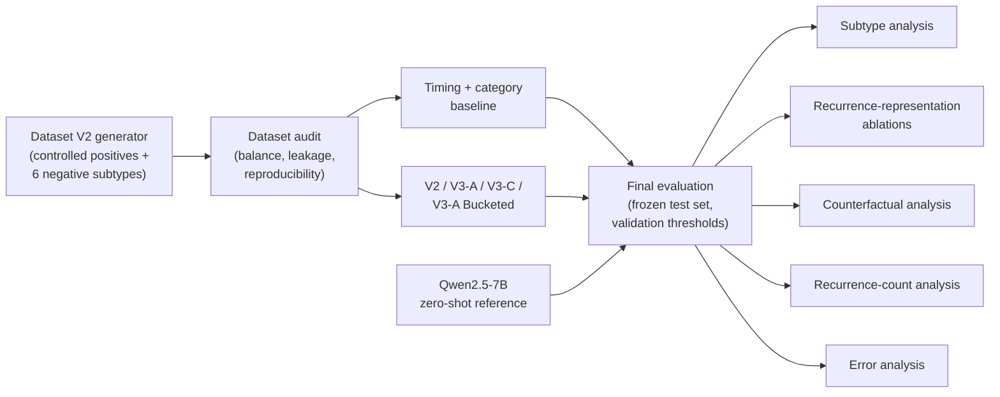

# Socia Research — Temporal Behavioral Pattern Recurrence Detection

An independent ML research module investigating whether a model can distinguish **genuine temporal recurrence** in a longitudinal sequence of behavioral events from sequences that are superficially similar in timing, category composition, or event order.

This is a **research module**, separate from Socia's production system (see [Research vs. Production](docs/problem_definition.md#research-vs-production-boundary)).

It does not make clinical, diagnostic, or general claims about human behavior. Instead, it evaluates recurrence-sensitive models on a controlled, synthetic benchmark designed to isolate specific sequence-level properties.

The research system is currently **offline and experimental**. It is not integrated into Socia's production pattern-detection pipeline.

---

## What is this?

Socia's production system currently promotes repeated behavioral observations to a user-visible pattern using a deterministic application-level rule.

The research module asks a narrower question:

> Can a sequence model distinguish operationally defined temporal recurrence from superficially similar sequences that differ in timing, category composition, or event structure?

The research models are **not currently used by the production application**.

The benchmark defines recurrence synthetically and operationally. Therefore, success on this benchmark should not be interpreted as validated detection of real-world psychological or behavioral traits.

---

## Research question

> Given a 25-event window of behavioral events, can a model distinguish a genuinely recurring ordered category pattern — the same category tuple appearing at least twice as temporally separated sites — from sequences that are superficially similar but do not satisfy the benchmark's recurrence definition?

The first iteration (V1) exposed several dataset shortcuts. The benchmark was subsequently redesigned as V2 to address those issues and provide a more controlled evaluation setting.

The current research therefore consists of:

* V1 — original benchmark and shortcut investigation
* V2 — redesigned synthetic benchmark
* V3-A — recurrence-aware Transformer with learned event-order representation
* V3-C — controlled removal of the learned order embedding
* V3-A Bucketed — recurrence representation using fixed temporal-gap buckets
* timing + category baseline
* recurrence-representation ablations
* counterfactual sensitivity tests
* recurrence-count analysis
* subtype/error analysis
* zero-shot Qwen2.5-7B reference experiment

---

# Key results

The **current V2 benchmark** contains an identical frozen test set of 2,000 examples:

* 1,000 positive
* 1,000 negative

Thresholds for the primary operating-point metrics were selected from validation data.

V1 is **not included in this table** because it was evaluated on the earlier V1 benchmark.

| Model                          |   ROC-AUC |    PR-AUC |        F1 | Precision |    Recall |  Accuracy |
| ------------------------------ | --------: | --------: | --------: | --------: | --------: | --------: |
| **Timing + category baseline** | **0.807** | **0.759** | **0.762** |     0.662 | **0.899** | **0.720** |
| V2                             |     0.747 |     0.701 |     0.729 |     0.635 |     0.856 |     0.682 |
| V3-A                           |     0.774 |     0.722 |     0.731 | **0.688** |     0.779 |     0.713 |
| V3-C                           |     0.770 |     0.716 | **0.736** |     0.659 |     0.834 |     0.702 |
| V3-A Bucketed                  |     0.776 | **0.730** |     0.720 |     0.677 |     0.769 |     0.701 |

A separate zero-shot Qwen2.5-7B experiment is reported below because it is not a trained sequence-model baseline and used a single fixed prompt.

### Main result

The timing + category baseline remains highly competitive and exceeds all current neural models on ROC-AUC and PR-AUC on the V2 test set.

At the same time, the neural experiments reveal substantial dependence on the recurrence-related representations supplied to the models. Removing or globally misaligning those representations causes large drops in ranking performance.

These two findings should be considered together:

> The current experiments do not show that neural sequence modeling outperforms simple aggregate timing/category features. They do show that the trained neural models make substantial use of their recurrence-related representations.

The latter should not be interpreted as proof that the models have learned a validated or psychologically meaningful concept of behavioral recurrence.

---

# Research pipeline



---

# Dataset at a glance

The current primary benchmark is V2.

|                                   |   Train | Validation |    Test |
| --------------------------------- | ------: | ---------: | ------: |
| Total examples                    |  12,000 |      2,000 |   2,000 |
| Positive                          |   6,000 |      1,000 |   1,000 |
| Negative                          |   6,000 |      1,000 |   1,000 |
| Class balance                     | 50 / 50 |    50 / 50 | 50 / 50 |
| Max single negative subtype share |    ≤22% |       ≤22% |    ≤22% |
| User overlap across splits        |       0 |          0 |       0 |
| Pattern tuple overlap             |       0 |          0 |       0 |
| Category-set overlap              |       0 |          0 |       0 |

Six deliberately constructed negative subtypes are used:

* `timing_matched`
* `order_permutation`
* `boundary_single_occurrence`
* `category_identity`
* `boundary_tight_burst`
* `pure_background`

These were introduced to make the benchmark less dependent on the shortcuts identified during V1 analysis.

See [`docs/dataset.md`](docs/dataset.md) for the construction and audit details.

---

# V1: the original benchmark

V1 is retained as a historical experiment because it motivated the redesign.

Its audit identified several problematic shortcuts, including:

* approximately 54.6% of positive windows containing only one intended recurrence
* substantial negative examples originating from a separate control-user population
* strong performance from simple category/timing statistics
* extensive overlap between selected windows
* category-set relationships that could provide shortcut information

The V2 benchmark was redesigned in response to these findings.

V1's final test result was:

| Metric    |     V1 |
| --------- | -----: |
| ROC-AUC   | 0.6752 |
| PR-AUC    | 0.6147 |
| F1        | 0.7251 |
| Precision | 0.5825 |
| Recall    | 0.9600 |
| Accuracy  | 0.6360 |

V1 should **not** be directly compared with the V2-family results above because it uses a different benchmark.

See [`docs/experiments.md`](docs/experiments.md#v1--the-original-benchmark-and-the-shortcut-problem).

---

# Model progression

## V2

The V2 model uses:

* category embeddings
* temporal features
* relative-time attention bias
* manual self-attention
* learned attention pooling
* classification head

Its temporal representation includes:

```text
abs_norm
gap_prev_norm
gap_same_cat_norm
has_prev_same_category
```

The training protocol also includes auxiliary ranking/reordering losses.

Best validation checkpoint:

* epoch 25
* validation F1: 0.7380
* threshold: 0.25

---

## V3-A

V3-A uses the V2-style recurrence representation and adds a learned event-order embedding.

It uses plain BCE training.

Best validation checkpoint:

* epoch 33
* validation F1: 0.7576
* threshold: 0.45
* precision: 0.6873
* recall: 0.8440

---

## V3-C

V3-C is a controlled ablation of V3-A.

Its architectural difference is the removal of the learned event-order embedding.

Best validation checkpoint:

* epoch 29
* validation F1: 0.7686
* threshold: 0.40
* precision: 0.6696
* recall: 0.9020

The original test results do not show a uniform effect of the order embedding:

* V3-A has higher ROC-AUC and PR-AUC
* V3-C has higher F1 and recall

This is therefore a trade-off rather than a universal improvement.

---

## V3-A Bucketed

This variant replaces the continuous same-category recurrence representation with a learned recurrence-gap bucket representation.

The seven buckets are:

* `NO_PRIOR`
* `0-6h`
* `6-24h`
* `24-72h`
* `72-168h`
* `168-336h`
* `>336h`

Best validation checkpoint:

* epoch 34
* validation F1: 0.7716
* threshold: 0.45
* precision: 0.6965
* recall: 0.8650

---

# Timing + category baseline

The main non-neural baseline is a `HistGradientBoostingClassifier`.

It uses aggregate timing and category features, including:

* total duration
* timing-gap statistics
* counts under multiple gap thresholds
* category counts
* number of unique categories
* maximum category count
* Shannon entropy

It does not explicitly model sequence order or recurrence-site identity.

On the V2 frozen test set:

* ROC-AUC: 0.807
* PR-AUC: 0.759
* F1: 0.762
* precision: 0.662
* recall: 0.899
* accuracy: 0.720

This baseline is an important result rather than merely a control: it shows that aggregate timing and category information remains sufficient to obtain strong performance on the current synthetic benchmark.

---

# Recurrence-representation ablations

One of the main additional experiments asks:

> How much do the trained neural models depend on their explicit recurrence-related representation?

Two interventions were used.

## Option A — no-prior recurrence representation

The continuous recurrence channels

```text
gap_same_category_norm
has_prev_same_category
```

were replaced with a no-prior representation.

ROC-AUC changed as follows:

| Model | Original | No-prior |       Δ |
| ----- | -------: | -------: | ------: |
| V2    |   0.7470 |   0.4012 | -0.3458 |
| V3-A  |   0.7738 |   0.6520 | -0.1218 |
| V3-C  |   0.7698 |   0.6526 | -0.1172 |

The large changes indicate substantial dependence on the recurrence representation.

For V2, V3-A, and V3-C, the official validation-derived threshold produced F1 = 0 after the intervention because the output distribution shifted strongly.

This should **not** be interpreted as complete loss of all ranking information. After selecting a new threshold on the test set, non-zero F1 remained.

The primary interpretation therefore uses ROC-AUC/PR-AUC rather than the zero official-threshold F1.

---

## Option B — global recurrence-feature permutation

A second intervention globally shuffled recurrence-feature pairs across test events using a fixed seed.

For continuous models, the shuffled pair was:

```text
(gap_same_category_norm, has_prev_same_category)
```

This preserves the marginal feature distribution while disrupting its original event-level alignment.

ROC-AUC:

| Model | Original | Global recurrence-feature permutation |
| ----- | -------: | ------------------------------------: |
| V2    |   0.7470 |                                0.4882 |
| V3-A  |   0.7738 |                                0.5142 |
| V3-C  |   0.7698 |                                0.5508 |

The degradation is consistent with the models relying on the event-level alignment between recurrence features and the sequence context.

However, this is an intervention result, not a proof of causal or semantic understanding.

---

## Bucketed recurrence permutation

For V3-A Bucketed, recurrence bucket IDs were globally shuffled.

This is related to Option B but is **not identical** to continuous-feature permutation.

Results:

```text
Original ROC-AUC: 0.7756
Bucket permutation ROC-AUC: 0.6278
```

The smaller but still substantial degradation suggests that the coarse bucket representation retains some predictive information after its original event-level alignment is disrupted.

This should be treated as an empirical observation rather than a proven mechanism.

---

# Counterfactual analysis

Counterfactual experiments were run on 300 genuine positive test examples.

The transformations were:

* order permutation
* timestamp collapse
* identity substitution

These tests measure **output sensitivity to controlled synthetic interventions**.

They do not establish causal or semantic understanding.

### Order permutation

Expected-direction rates:

| Model             | Expected-direction rate |
| ----------------- | ----------------------: |
| Timing + category |                    0.0% |
| V3-A              |                   48.3% |
| V3-C              |                   53.3% |

The neural models therefore showed approximately chance-level output sensitivity to this particular order-scrambling intervention.

This is evidence against making a strong claim that the current models reliably respond to internal event-order changes.

### Timestamp collapse

| Model             | Expected-direction rate |
| ----------------- | ----------------------: |
| Timing + category |                   49.3% |
| V3-A              |                   61.0% |
| V3-C              |                   63.7% |

### Identity substitution

| Model             | Expected-direction rate |
| ----------------- | ----------------------: |
| Timing + category |                   82.0% |
| V3-A              |                   82.7% |
| V3-C              |                   82.0% |

These results indicate different levels of output sensitivity to different synthetic interventions, but they should not be interpreted as proof of semantic understanding.

---

# Recurrence-count analysis

Historical evaluation also examined predictions as the intended number of recurrence sites increased.

For positive examples:

| Intended sites |   N | Baseline recall | V3-A recall | V3-C recall |
| -------------- | --: | --------------: | ----------: | ----------: |
| 2              | 487 |           0.842 |       0.694 |       0.756 |
| 3              | 360 |           0.950 |       0.828 |       0.892 |
| 4              | 153 |           0.961 |       0.935 |       0.948 |

All three systems showed increasing recall with increasing recurrence count.

However, the same monotonic trend appears in the baseline.

Therefore this analysis does **not** establish that the neural models specifically learned recurrence counting.

---

# Subtype analysis

Historical subtype analysis showed that `order_permutation` was the largest source of false positives for all compared systems.

False-positive rates:

| Negative subtype           | Baseline |  V3-A |  V3-C |
| -------------------------- | -------: | ----: | ----: |
| order_permutation          |    0.915 | 0.785 | 0.840 |
| category_identity          |    0.700 | 0.500 | 0.631 |
| pure_background            |    0.450 | 0.220 | 0.380 |
| timing_matched             |    0.355 | 0.355 | 0.441 |
| boundary_tight_burst       |    0.208 | 0.092 | 0.142 |
| boundary_single_occurrence |    0.085 | 0.025 | 0.050 |

These subtype results are useful for understanding error structure, but they should not be interpreted as evidence that the neural models are globally superior to the baseline.

---

# Zero-shot Qwen2.5-7B reference experiment

A separate experiment evaluated Qwen2.5-7B zero-shot on the same frozen V2 test set using one fixed prompt.

Results:

| Metric    | Qwen2.5-7B |
| --------- | ---------: |
| Accuracy  |      0.508 |
| Precision |      0.504 |
| Recall    |      0.999 |
| F1        |      0.670 |
| ROC-AUC   |      0.521 |

Confusion matrix:

```text
TN = 17
FP = 983
FN = 1
TP = 999
```

Runtime:

* total: 6993.44 seconds
* approximately 3.50 seconds/sample

The result is consistent with a model that predicts almost every example as positive.

This is a benchmark of **one model, one prompt, and one evaluation protocol**. It should not be generalized to LLMs as a class.

---

# What the experiments currently show

The current evidence supports three main observations.

### 1. Aggregate features remain highly competitive

The timing + category baseline achieves higher ROC-AUC and PR-AUC than the neural models on V2.

The current benchmark therefore does not demonstrate that Transformer-based sequence modeling is superior to aggregate timing/category features.

### 2. Neural models depend substantially on recurrence representations

Removing or globally permuting recurrence-related features produces substantial ranking degradation across V2, V3-A, and V3-C.

This is evidence of **model dependence on the supplied recurrence representation**.

### 3. Dependence is not equivalent to validated recurrence understanding

The benchmark itself defines the recurrence structure.

Therefore the ablations demonstrate sensitivity to a representation associated with benchmark recurrence, but they do not establish that the model has learned a validated real-world behavioral concept.

---

# Limitations

* **Entirely synthetic data** — no real longitudinal user data has been used.
* **Benchmark-generator dependence** — models may exploit regularities specific to the synthetic generator.
* **Neural models do not beat the timing + category baseline** on the primary ranking metrics.
* **No real-world validation** — generalization to real behavioral sequences is unknown.
* **No calibrated probability interpretation** — output scores are not validated probabilities of recurrence.
* **Counterfactual tests are synthetic interventions** and do not establish causal or semantic understanding.
* **Order sensitivity is not established** by the current counterfactual experiment.
* **Recurrence dependence is established only operationally** through representation ablations; it is not evidence of psychological validity.
* **V2 and V3 training protocols are not identical**: V2 uses additional auxiliary losses while V3-A/V3-C use plain BCE.
* **Bucketed and continuous recurrence permutations are different interventions** and should not be treated as identical.
* **Threshold-selected metrics depend on the chosen operating point**.
* **Best-test-threshold F1 is diagnostic only**, because the test set is used to choose that threshold.
* **Zero-shot LLM evaluation uses one model and one prompt**.
* **Research is not integrated into production**.

---

# Research vs. Production boundary

```text
SOCIA
│
├── Production
│   ├── LLM signal extraction
│   ├── deterministic pattern promotion
│   ├── episodic memory
│   ├── synthesized memories
│   └── Journeys
│
└── Research
    ├── synthetic recurrence benchmark
    ├── V1
    ├── V2
    ├── V3-A
    ├── V3-C
    ├── V3-A Bucketed
    ├── timing + category baseline
    ├── recurrence ablations
    ├── counterfactual tests
    └── zero-shot LLM benchmark
```

The research models currently have **no influence on production predictions or user-facing pattern detection**.

Any future integration should follow additional validation on appropriate real-world longitudinal data.

---

# Documentation

| Document                                                                     | Contents                                                                                       |
| ---------------------------------------------------------------------------- | ---------------------------------------------------------------------------------------------- |
| [`docs/problem_definition.md`](docs/problem_definition.md)                   | Research question, operational recurrence definition, research-vs-production boundary          |
| [`docs/dataset.md`](docs/dataset.md)                                         | V2 construction, six negative subtypes, examples, audit and reproducibility                    |
| [`docs/methodology.md`](docs/methodology.md)                                 | Baseline, V2/V3 architectures, training protocols and checkpoints                              |
| [`docs/evaluation.md`](docs/evaluation.md)                                   | Main results, ablations, counterfactuals, recurrence-count and subtype analysis, LLM benchmark |
| [`docs/experiments.md`](docs/experiments.md)                                 | V1 → audit → V2 redesign → model progression → final evaluation                                |
| [`docs/limitations_and_future_work.md`](docs/limitations_and_future_work.md) | Scientific limitations and future validation roadmap                                           |

---

# Reproducibility

The current benchmark uses deterministic generation with:

```text
Dataset seed: 20260925
Recurrence permutation seed: 20260829
```

The V2 dataset was regenerated and verified byte-identical to the corresponding generation/diagnostic artifacts.

Additional audit checks include:

* 50/50 class balance
* zero user overlap
* zero pattern-tuple overlap
* zero category-set overlap
* negative subtype balance constraints
* train-derived time-normalization consistency
* counterfactual validity checks

The final evaluation uses frozen checkpoints and validation-derived operating thresholds.

The exact commands and generated artifacts should be kept synchronized with the current repository implementation; do not document commands that are no longer supported by the final evaluation runner.

---

# Portfolio-level summary

> Developed an independent behavioral-sequence ML research pipeline for Socia to study recurrence detection on a controlled synthetic longitudinal benchmark. Redesigned and audited the benchmark after identifying shortcut risks in an initial version, then evaluated multiple Transformer variants, a timing-and-category baseline, recurrence-representation ablations, counterfactual interventions, and a zero-shot LLM reference. The experiments show that aggregate timing/category features remain highly competitive, while neural models exhibit substantial dependence on their recurrence-related representations. The work remains an offline research prototype evaluated on synthetic data and is not yet validated on real behavioral sequences or integrated into production.
