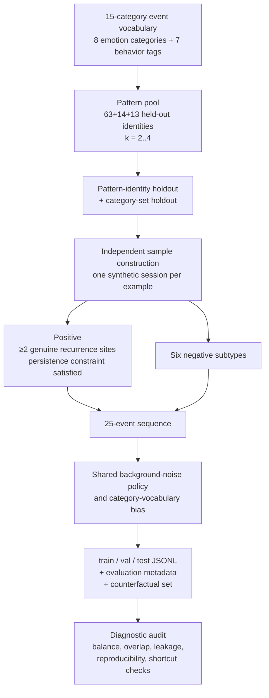

# Dataset V2 — Recurrence-Aware Benchmark

Dataset V2 is the frozen benchmark used for the final V2-family experiments
reported in this repository.

It was designed from scratch in response to the shortcut and label-construction
problems identified in the original V1 benchmark. V1 is retained separately
as a historical artifact and is not described as part of the V2 dataset.

The purpose of V2 is to create a controlled classification task in which
positive examples contain temporally persistent recurrence, while negative
examples reproduce several superficially similar situations without satisfying
the recurrence definition.

The benchmark is synthetic. Its construction provides exact ground truth and
controlled interventions, but it is not intended to reproduce the statistical
properties of real human behavioral data.

---

# Generation pipeline



Every sample is constructed independently as a fixed-length 25-event sequence.

Positive and negative examples use the same general background-event
generation policy and the same 15-category vocabulary.

There is:

* no shared 120-day user timeline;
* no stride-based extraction of overlapping windows;
* no separate control-user population supplying most negatives;
* no dominant easy-background negative population.

These design choices directly address major issues identified in the V1 audit.

---

# Event vocabulary

The benchmark uses a fixed vocabulary of **15 event categories**:

* 8 emotion categories;
* 7 behavior categories.

The vocabulary is inherited from the Socia application taxonomy and is reused
unchanged throughout the benchmark.

The categories are labels for synthetic events. They should not be interpreted
as clinical or psychological measurements.

---

# Recurrence definition

A positive example contains at least **two genuine recurrence sites**.

A recurrence site is a local occurrence of the same ordered category tuple.
Tuple length is:

`k ∈ {2, 3, 4}`

Within each site:

* the categories occur in the canonical tuple order;
* the site satisfies the local burst constraint.

For two consecutive recurrence sites, let:

* `B_i` = temporal span of site `i`;
* `G_i` = temporal gap between the end of site `i` and the beginning of site
  `i+1`.

The persistence condition requires:

`G_i ≥ 2 days`

and

`G_i ≥ 3 × B_i`

for consecutive sites.

Therefore, a positive is not defined simply by repeated categories or by
multiple occurrences. It must contain temporally separated instances of the
same ordered pattern.

---

# Positive and negative construction

The benchmark contains one positive class and six explicitly constructed
negative subtypes.

| Subtype                      | Label | Construction                                                                                                                       | Intended control                                               |
| ---------------------------- | ----: | ---------------------------------------------------------------------------------------------------------------------------------- | -------------------------------------------------------------- |
| `positive`                   |     1 | 2–4 genuine sites of the same ordered tuple, with canonical within-site order and persistence-satisfying gaps                      | Target recurrence condition                                    |
| `timing_matched`             |     0 | Same site count, timing, gaps, and span as a matched positive, but each site receives an independent random tuple                  | Recurrence identity while preserving temporal structure        |
| `category_identity`          |     0 | Same category multiset as a genuine pattern, but categories are scattered independently without burst structure or canonical order | Category-frequency / bag-of-categories shortcuts               |
| `order_permutation`          |     0 | Same site timing and per-site category sets as a genuine positive, but within-site order is permuted                               | Sensitivity to canonical sequence order                        |
| `boundary_single_occurrence` |     0 | Exactly one genuine, well-formed occurrence                                                                                        | Positive/negative boundary at one occurrence                   |
| `boundary_tight_burst`       |     0 | Two genuine occurrences with correct identity and order, but inter-occurrence gap below the persistence threshold                  | Distinguish persistent recurrence from a single temporal burst |
| `pure_background`            |     0 | No injected recurrence structure; temporal span is sampled under the same general span policy                                      | Background sanity check                                        |

The six negative types are intentionally heterogeneous. No single negative
construction is intended to represent all forms of non-recurrence.

---

# Why each negative subtype matters

### `timing_matched`

This is one of the strongest controls against a simple temporal-density
solution.

A positive and its matched negative can have the same number of sites and
similar timing characteristics, while the category identity recurring across
sites is removed.

The intended distinction is therefore the recurrence of the pattern itself,
rather than simply the presence of repeated temporal bursts.

### `category_identity`

This subtype preserves category composition while removing the local temporal
and sequential structure.

It tests whether a model can distinguish:

> the right categories occurring in the window

from:

> those categories forming the intended recurring sequence.

### `order_permutation`

The timing and category membership of the constructed sites are retained,
while canonical within-site order is broken.

This is the benchmark's most direct test of sensitivity to event order.

It is particularly relevant to V3-A, which explicitly introduces a learned
event-order embedding.

### `boundary_single_occurrence`

This subtype contains one genuine occurrence but does not satisfy the
recurrence requirement of at least two persistent sites.

It directly closes a major flaw identified in V1, where a substantial fraction
of positive windows contained only one true occurrence.

### `boundary_tight_burst`

This subtype contains two genuine occurrences with the correct identity and
order, but their separation is too short to satisfy the persistence rule.

It therefore separates:

* repeated structure within one temporal burst; from
* temporally persistent recurrence.

### `pure_background`

This subtype contains no injected recurrence structure.

It is intentionally a minority negative class rather than the dominant source
of negatives. This prevents the benchmark from being dominated by easy
background examples of the kind that contributed to the V1 shortcut.

---

# Real examples from the frozen test set

The following examples are actual generated samples from the frozen test set,
not hand-written illustrations.

`site positions` identify the event indices belonging to constructed
recurrence sites. Events outside those positions are generated background
events.

## Positive

A positive example containing four recurrence sites of a recurring tuple over
approximately 23.3 days:

```text
sites at positions: [2,3,5] [10,11,12] [17,19,20] [22,23,24]

categories:
emotional_dysregulation, excitement, approach_coping, excitement, excitement,
overthinking, excitement, fear, avoidance, excitement, approach_coping, excitement,
overthinking, fear, reassurance_seeking, frustration, self_criticism, approach_coping,
overthinking, excitement, overthinking, excitement, approach_coping, excitement, overthinking

delta_hours:
0.0, 21.7, 37.2, 37.9, 38.5, 39.1, 53.5, 57.9, 116.7, 151.0,
226.4, 230.1, 233.2, 301.9, 302.4, 302.6, 313.1, 365.5,
366.7, 370.7, 372.7, 463.3, 477.7, 482.4, 487.1
```

## `order_permutation`

A negative example with matching site timing and category sets, but canonical
within-site order disrupted:

```text
sites at positions: [1,2,3,4] [11,12,13,14] [18,19,20,21]

categories:
sadness, self_criticism, emotional_dysregulation, overthinking, hope,
emotional_dysregulation, avoidance, sadness, avoidance, withdrawal,
shame, emotional_dysregulation, overthinking, self_criticism, hope,
anxiety, emotional_dysregulation, self_criticism, hope, overthinking,
emotional_dysregulation, self_criticism, fear, self_criticism, fear

delta_hours:
0.0, 2.3, 7.9, 10.2, 15.1, 33.1, 50.7, 54.7, 59.0, 63.2,
64.9, 74.3, 80.1, 83.7, 87.0, 107.9, 129.1, 135.6,
151.3, 152.5, 155.0, 159.5, 190.1, 192.1, 226.1
```

## `boundary_single_occurrence`

One genuine occurrence without a second persistent occurrence:

```text
site at positions: [1,4,5,6]

categories:
approach_coping, withdrawal, self_criticism, emotional_dysregulation, shame,
self_criticism, fear, frustration, fear, overthinking, shame, avoidance,
fear, reassurance_seeking, self_criticism, fear, shame, self_criticism,
fear, withdrawal, hope, excitement, confidence, self_criticism, hope

delta_hours:
0.0, 4.9, 5.3, 6.4, 8.6, 12.0, 13.7, 16.1, 16.5, 17.5,
19.6, 19.6, 21.6, 23.0, 35.4, 46.4, 55.3, 60.1,
61.3, 66.0, 71.4, 75.1, 78.1, 79.2, 82.4
```

## `category_identity`

A negative example containing the same category multiset as a genuine pattern,
but with the events scattered independently rather than organized into
recurrence sites:

```text
sites (single events, no burst) at positions:
0, 8, 11, 13, 15, 16, 17, 18, 19, 20, 21, 24

categories:
shame, reassurance_seeking, excitement, avoidance, avoidance,
self_criticism, self_criticism, reassurance_seeking, excitement, anxiety,
confidence, shame, frustration, avoidance, shame, avoidance, excitement,
emotional_dysregulation, emotional_dysregulation, emotional_dysregulation,
avoidance, excitement, self_criticism, emotional_dysregulation, shame
```

## `boundary_tight_burst`

Two genuine occurrences with correct identity and order, but separated by only
approximately 0.9 days:

```text
sites at positions:
[3,4,5,6] [9,10,11,12]

delta_hours of sites:
7.0, 9.4, 10.0, 13.1 | 30.3, 31.0, 34.9, 35.2
```

The gap is below the required persistence threshold.

## `pure_background`

An unstructured background sequence with no injected recurrence sites:

```text
sites: none

categories:
frustration, avoidance, excitement, avoidance, anxiety, shame,
reassurance_seeking, frustration, shame, hope, overthinking, fear,
shame, excitement, reassurance_seeking, overthinking, shame,
overthinking, hope, hope, fear, fear, self_criticism, shame, confidence
```

---

# Dataset composition

The final dataset contains 16,000 examples:

* 12,000 training examples;
* 2,000 validation examples;
* 2,000 test examples.

The exact subtype composition is:

| Subtype                      |      Train | Validation |      Test |
| ---------------------------- | ---------: | ---------: | --------: |
| `positive`                   |      6,000 |      1,000 |     1,000 |
| `timing_matched`             |      1,320 |        220 |       220 |
| `order_permutation`          |      1,200 |        200 |       200 |
| `boundary_single_occurrence` |      1,200 |        200 |       200 |
| `category_identity`          |        960 |        160 |       160 |
| `boundary_tight_burst`       |        720 |        120 |       120 |
| `pure_background`            |        600 |        100 |       100 |
| **Total**                    | **12,000** |  **2,000** | **2,000** |

Every split is exactly **50% positive / 50% negative**.

Within the negative class, `timing_matched` is the largest subtype and accounts
for **22%** of negatives. No negative subtype dominates the benchmark.

The pattern pool contains:

* **63** pattern identities in training;
* **14** in validation;
* **13** in test.

Pattern identities are ordered category tuples with lengths 2–4.

---

# Split isolation and leakage controls

The V2 split is designed to prevent models from solving the task by recognizing
pattern identities or familiar category combinations.

The final audit verified:

| Check                                                           |  Result |
| --------------------------------------------------------------- | ------: |
| Exact-tuple overlap: train ↔ validation                         |       0 |
| Exact-tuple overlap: train ↔ test                               |       0 |
| Exact-tuple overlap: validation ↔ test                          |       0 |
| Category-set overlap, including equal/subset/superset relations |       0 |
| User overlap across splits                                      |       0 |
| Class balance in every split                                    | 50 / 50 |
| Maximum negative-subtype share                                  |     22% |

### Why category-set isolation matters

Exact tuple disjointness alone is not sufficient.

For example, a held-out tuple such as:

`[A, B, C]`

could still be trivially related to a training pattern such as:

`[A, B]`

or:

`[C, A, B]`.

A model could therefore recognize a familiar collection of categories without
generalizing to a genuinely unfamiliar pattern composition.

V2 explicitly checks for equal, subset, and superset category-set relations
across the pattern pools.

The final audit found **zero such relations**.

---

# Reproducibility audit

The benchmark was regenerated independently from the recorded configuration.

The final audit found:

| Check                                               | Result                       |
| --------------------------------------------------- | ---------------------------- |
| Full dataset regeneration                           | **byte-for-byte identical**  |
| Train/validation/test class balance                 | **50 / 50**                  |
| User overlap                                        | **0**                        |
| Exact tuple overlap                                 | **0**                        |
| Category-set overlap                                | **0**                        |
| Maximum negative subtype share                      | **22%**                      |
| Invalid counterfactual `delta_hours` values         | **0 / 1,200**                |
| Checkpoint vs. train-derived time statistics        | matched to float32 precision |
| Maximum normalization-statistic absolute difference | approximately **2.6 × 10⁻⁷** |

The time-normalization cross-check was performed independently by recomputing
the relevant statistics from `train.jsonl` and comparing them with the
statistics stored in the frozen model checkpoints.

The agreement provides an additional consistency check that the evaluated
checkpoints correspond to the intended dataset normalization rather than only
matching the dataset filename.

---

# Counterfactual evaluation set

A separate `counterfactual_eval.jsonl` file contains **1,200** evaluation rows
used by the counterfactual experiments.

The audit verified that:

* all generated `delta_hours` values are finite;
* no transformed sequence contains negative elapsed time;
* no transformed sequence violates the expected monotonicity of cumulative
  elapsed time.

The file is used only for evaluation interventions and is not part of model
training.

---

# What V2 fixes relative to V1

The V2 redesign directly addresses the principal issues found during the V1
audit.

| V1 issue                                                | V2 response                                           |
| ------------------------------------------------------- | ----------------------------------------------------- |
| Positive windows could contain only one true occurrence | Positive requires ≥2 persistent recurrence sites      |
| Large separate control-user negative population         | Every sample constructed independently                |
| Dominant easy-background negatives                      | Six explicit negative subtypes                        |
| Category-set leakage across pattern pools               | Equal/subset/superset category-set isolation          |
| Heavy overlap from sliding windows                      | No shared long timeline or stride-1 window extraction |
| Weak control of timing/category shortcuts               | Timing-matched and composition-controlled negatives   |
| Limited order-specific testing                          | Dedicated `order_permutation` subtype                 |

The redesign substantially reduces the predictive advantage of the
timing/category-only baseline:

* V1 timing+category ROC-AUC: approximately **0.883**
* V2 timing+category ROC-AUC: approximately **0.807–0.809**

Similarly, the single-feature `cat_entropy` baseline decreases from
approximately **0.819** on V1 to approximately **0.68** on V2.

These changes indicate that V2 is harder for the audited shortcuts than V1.

They do **not** demonstrate that all shortcuts have been eliminated. The
timing+category baseline remains substantially predictive on V2, which is an
important limitation of the benchmark.

---

# Reproducibility

The dataset generator is deterministic given:

`BASE_SEED = 20260925`

The complete benchmark can be regenerated with:

```bash
cd research/dataset/v2

python build_dataset.py
python diagnostics.py data
```

Regeneration produces:

```text
train.jsonl
val.jsonl
test.jsonl
pattern_pool.json
counterfactual_eval.jsonl
```

The independently regenerated dataset was byte-for-byte identical to the
frozen dataset used for the reported experiments.

The diagnostic script reproduces the benchmark composition and audit checks
described above.

---

# Scope and interpretation

Dataset V2 provides a controlled synthetic environment for studying a specific
operational definition of temporal recurrence.

It supports experiments about:

* recurrence under controlled timing constraints;
* sensitivity to category identity;
* sensitivity to sequence order;
* dependence on temporal representations;
* behavior under controlled counterfactual interventions;
* generalization across held-out synthetic pattern identities.

It does **not** establish:

* that the synthetic event process represents real human behavior;
* that the category vocabulary corresponds to validated psychological
  constructs;
* that a model trained on V2 can detect recurrence in real conversations;
* that model performance represents genuine psychological understanding;
* that recurrence detected under this definition is equivalent to any clinical
  or behavioral phenomenon.

The benchmark should therefore be understood as a controlled experimental
instrument, not as a validated behavioral dataset.
