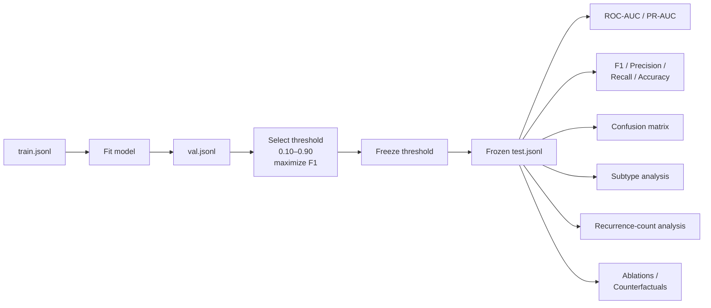
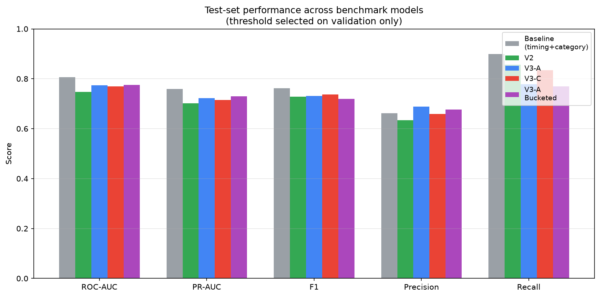
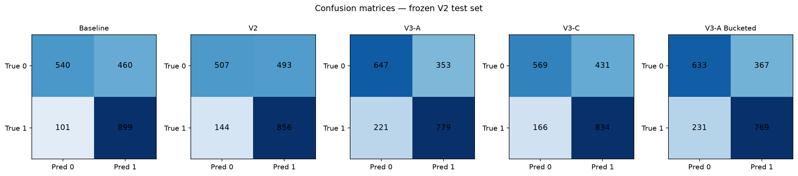
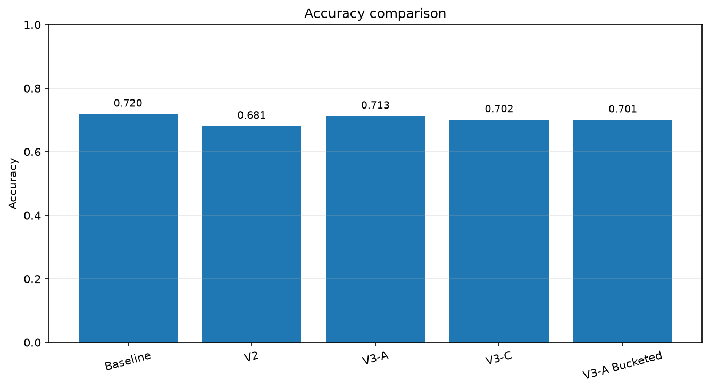
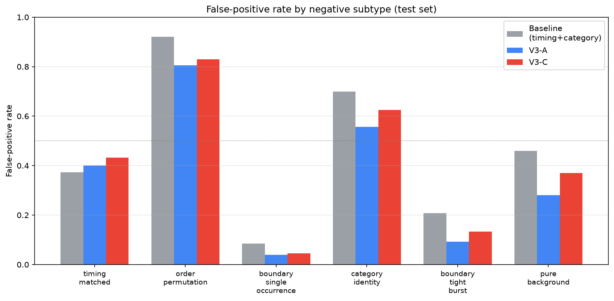
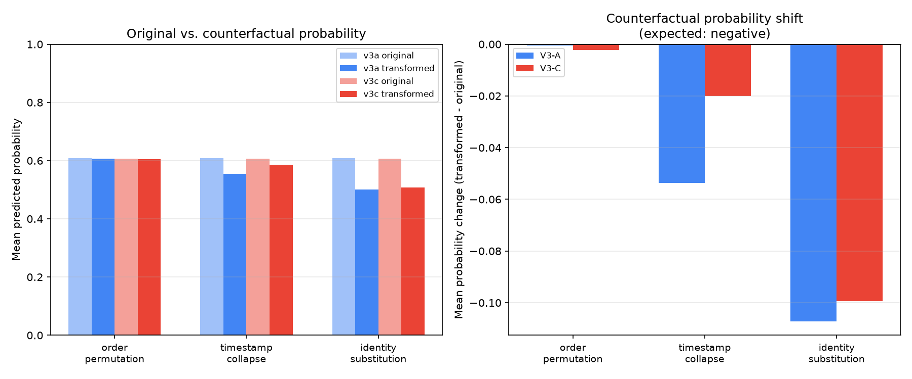
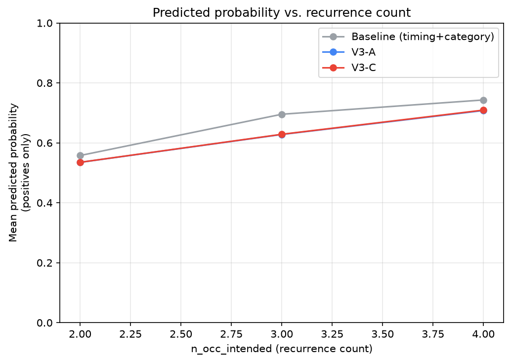
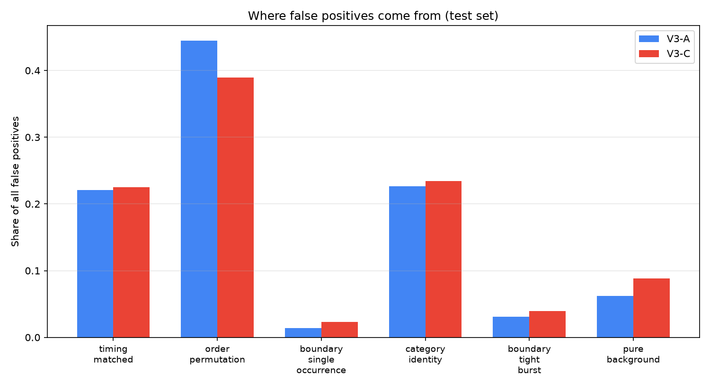

# Evaluation

## Evaluation protocol

The final evaluation separates three types of analysis:

1. **Primary benchmark performance** — threshold-independent ranking metrics on the frozen V2 test set.
2. **Threshold-dependent diagnostics** — classification metrics at a threshold selected on validation data only.
3. **Controlled interventions** — ablations, permutations, and counterfactuals designed to test model dependence on recurrence-related information.

### Frozen test set

All V2-family models and the timing + category baseline are evaluated on the same frozen V2 test set:

* **2,000 examples**
* **1,000 positive**
* **1,000 negative**

The identity and ordering of the test examples were verified programmatically rather than assumed.

The historical V1 model is **not** included in this direct comparison because it was trained and evaluated on the earlier V1 benchmark.

### Threshold selection

For threshold-dependent metrics, the classification threshold is selected using the validation split only.

The evaluation protocol sweeps thresholds from **0.10 to 0.90 in steps of 0.05** and selects the threshold that maximizes validation F1.

That threshold is then frozen and applied to the test set.

The test labels are never used to select the official threshold.

For V3-A and V3-C, the final evaluation pipeline independently regenerated validation predictions and recovered the same stored threshold and validation F1 as the training checkpoints, to four decimal places.

### Primary metrics

The primary model-comparison metrics are:

* **ROC-AUC**
* **PR-AUC**

These metrics are threshold-independent and therefore provide the main basis for comparing models.

Threshold-dependent metrics are reported as secondary diagnostics:

* F1
* precision
* recall
* accuracy
* confusion matrix

A separate **best-test-F1 threshold** may be reported for diagnostic purposes, but it is not treated as a primary generalization result because selecting it uses the test labels.

---

# Baseline reproducibility

The timing + category baseline is refit from scratch on the training split during the final evaluation run.

An earlier independent run using the same feature construction, classifier, and `random_state=0` produced:

* threshold: **0.35**
* F1: **0.7615**
* ROC-AUC: **0.8094**

The final official run produced:

* threshold: **0.36**
* F1: **0.7622**
* ROC-AUC: **0.8069**

The small difference was investigated and is attributed to floating-point non-determinism in the histogram-binning implementation of `HistGradientBoostingClassifier`, which can vary across platforms, threading configurations, or library versions despite a fixed random seed.

The dataset, feature construction, model configuration, and evaluation protocol were unchanged.

The values reported below are from the final official evaluation run.

---

# Final V2 benchmark results

The following approaches were evaluated on the same frozen V2 test set:

* Timing + category baseline
* V2
* V3-A
* V3-C
* V3-A Bucketed Recurrence

All values are taken from the final evaluation outputs.

| Model                      |     N | Threshold |   ROC-AUC |    PR-AUC |        F1 | Precision |    Recall |  Accuracy |
| -------------------------- | ----: | --------: | --------: | --------: | --------: | --------: | --------: | --------: |
| Timing + category baseline | 2,000 |      0.36 | **0.807** | **0.759** | **0.762** |     0.662 | **0.899** | **0.720** |
| V2                         | 2,000 |      0.25 |     0.747 |     0.701 |     0.729 |     0.635 |     0.856 |     0.682 |
| V3-A                       | 2,000 |      0.45 |     0.774 |     0.722 |     0.731 | **0.688** |     0.779 | **0.713** |
| V3-C                       | 2,000 |      0.40 |     0.770 |     0.716 |     0.736 |     0.659 |     0.834 |     0.702 |
| V3-A Bucketed              | 2,000 |      0.45 |     0.776 |     0.730 |     0.720 |     0.677 |     0.769 |     0.701 |

Confusion matrices:

| Model                      |  TP |  TN |  FP |  FN |
| -------------------------- | --: | --: | --: | --: |
| Timing + category baseline | 899 | 540 | 460 | 101 |
| V2                         | 856 | 507 | 493 | 144 |
| V3-A                       | 779 | 647 | 353 | 221 |
| V3-C                       | 834 | 569 | 431 | 166 |
| V3-A Bucketed              | 769 | 633 | 367 | 231 |

## Interpretation

The timing + category baseline achieves the highest ROC-AUC and PR-AUC on the final V2 benchmark.

The neural models therefore **do not outperform the aggregate baseline on the primary threshold-independent metrics**.

The models nevertheless exhibit different precision/recall trade-offs. For example, V3-A produces substantially fewer false positives than the baseline at its validation-selected threshold, but this comes with substantially lower recall.

Among the neural variants:

* **V3-C** has the highest F1 at its official threshold.
* **V3-A Bucketed** has the highest ROC-AUC and PR-AUC.
* **V3-A** has the highest precision and accuracy among the neural variants.

These metrics answer different questions and should not be collapsed into a single overall ranking.

The appropriate conclusion is therefore:

> The neural architectures provide competitive sequence-modeling baselines, but the current experiments do not establish an advantage over the simpler timing + category representation on this benchmark.

---

# Negative-subtype analysis

The subtype analysis uses the final frozen V2 test set and the official validation-selected thresholds.

It focuses on the timing + category baseline, V3-A, and V3-C because these models share the subtype-analysis pipeline used during the main model experiments.

| Subtype                      |     N | Baseline FPR | V3-A FPR | V3-C FPR |
| ---------------------------- | ----: | -----------: | -------: | -------: |
| `order_permutation`          |   200 |        0.915 |    0.785 |    0.840 |
| `category_identity`          |   160 |        0.700 |    0.500 |    0.631 |
| `pure_background`            |   100 |        0.450 |    0.220 |    0.380 |
| `timing_matched`             |   220 |        0.355 |    0.355 |    0.441 |
| `boundary_tight_burst`       |   120 |        0.208 |    0.092 |    0.142 |
| `boundary_single_occurrence` |   200 |        0.085 |    0.025 |    0.050 |
| `positive` — recall          | 1,000 |        0.899 |    0.779 |    0.834 |

V3-A has a lower false-positive rate than the baseline on every listed negative subtype, with an exact tie on `timing_matched`.

The largest absolute reductions are observed for:

* `category_identity`: 0.700 → 0.500
* `pure_background`: 0.450 → 0.220
* `order_permutation`: 0.915 → 0.785

V3-C also reduces false positives on most subtypes, but its `timing_matched` FPR is higher than the baseline:

**0.441 vs. 0.355.**

These differences show that aggregate benchmark metrics can hide meaningful differences in where models make their errors.

However, the lower false-positive rates of the neural models do not translate into better overall ranking performance because they are accompanied by lower positive recall at the selected thresholds:

* baseline recall: **0.899**
* V3-A recall: **0.779**
* V3-C recall: **0.834**

Subtype analysis therefore provides a more detailed description of model behavior rather than evidence of an overall model advantage.

---

# Recurrence-representation ablations

The final evaluation includes controlled interventions targeting recurrence-related representations used by the V2-family models.

These experiments are important because aggregate benchmark performance alone does not establish whether a model actually depends on the representations intended to encode recurrence.

## Option A — no-prior representation

The explicit same-category recurrence representation is replaced with a no-prior representation at test time.

The models are **not retrained** after this intervention.

### ROC-AUC

| Model | Original | No-prior |       Δ |
| ----- | -------: | -------: | ------: |
| V2    |   0.7470 |   0.4012 | -0.3458 |
| V3-A  |   0.7738 |   0.6520 | -0.1218 |
| V3-C  |   0.7698 |   0.6526 | -0.1172 |

Ranking performance drops substantially for all three models.

The official-threshold F1 becomes zero for all three because the intervention also shifts the score distribution substantially downward.

This does **not** mean that all ranking information has disappeared. A test-derived diagnostic threshold can still recover non-zero F1, but such a threshold is not a valid primary evaluation.

The main evidence from this intervention is therefore the degradation in ranking metrics rather than the zero F1 at the original threshold.

### Probability shifts

| Model | Mean Δ probability | Median Δ | Expected-direction rate |
| ----- | -----------------: | -------: | ----------------------: |
| V2    |            -0.3583 |  -0.3663 |                   1.000 |
| V3-A  |            -0.4556 |  -0.4764 |                  0.9975 |
| V3-C  |            -0.4088 |  -0.4238 |                  0.9875 |

The strong and consistent downward shifts show that the trained models make substantial use of the recurrence-related representation supplied at inference time.

This is evidence of **representation dependence**, not proof that the models have learned a validated concept of behavioral recurrence.

---

## Option B — global recurrence-feature permutation

For the continuous V2-family models, the pair

`(gap_same_category_norm, has_prev_same_category)`

is globally shuffled across test events.

This preserves the approximate marginal distribution of the two features while disrupting their original event-level alignment.

### ROC-AUC

| Model | Original | Permuted |       Δ |
| ----- | -------: | -------: | ------: |
| V2    |   0.7470 |   0.4882 | -0.2588 |
| V3-A  |   0.7738 |   0.5142 | -0.2596 |
| V3-C  |   0.7698 |   0.5508 | -0.2190 |

The substantial degradation, particularly toward chance-level ROC-AUC, suggests that the models depend not only on the marginal presence of recurrence features but also on their event-level alignment.

Again, this is a model-sensitivity result. It does not independently establish that the learned representation corresponds to a validated behavioral concept.

---

## Bucketed recurrence permutation

The bucketed model uses a discrete recurrence representation, so its corresponding intervention globally permutes the recurrence bucket IDs rather than the continuous feature pair.

| Model         | Original ROC-AUC | Bucket-permuted ROC-AUC |       Δ |
| ------------- | ---------------: | ----------------------: | ------: |
| V3-A Bucketed |           0.7756 |                  0.6278 | -0.1478 |

The degradation is smaller than for the continuous-feature interventions.

This indicates that the bucketed model retains more predictive performance under this particular intervention, but the experiment does not establish why.

The bucketed and continuous interventions should therefore not be interpreted as perfectly equivalent experiments.

---

# Counterfactual analysis

A separate counterfactual experiment was conducted on **300 genuine positive test examples**.

Each intervention modifies one aspect of the sequence while keeping the remaining information as stable as possible.

The evaluated transformations are:

* `order_permutation`
* `timestamp_collapse`
* `identity_substitution`

The measured quantity is the change in predicted probability.

| Transform               | Model    | Mean Δ probability | Expected-direction rate |
| ----------------------- | -------- | -----------------: | ----------------------: |
| `order_permutation`     | Baseline |             0.0000 |                    0.0% |
|                         | V3-A     |            -0.0005 |                   48.3% |
|                         | V3-C     |            -0.0023 |                   53.3% |
| `timestamp_collapse`    | Baseline |            +0.0004 |                   49.3% |
|                         | V3-A     |            -0.0536 |                   61.0% |
|                         | V3-C     |            -0.0200 |                   63.7% |
| `identity_substitution` | Baseline |            -0.1137 |                   82.0% |
|                         | V3-A     |            -0.1072 |                   82.7% |
|                         | V3-C     |            -0.0993 |                   82.0% |

## Order permutation

The baseline's exactly zero response is expected because none of its features encode event order.

V3-A and V3-C show near-chance expected-direction rates:

* V3-A: **48.3%**
* V3-C: **53.3%**

Their mean probability changes are also extremely small.

The current counterfactual experiment therefore does **not** provide evidence of strong, reliable output-level sensitivity to canonical event order.

This is particularly informative for V3-A because its architecture explicitly contains a learned order embedding.

However, the result does not prove that order information is unused internally. It only shows that this particular intervention did not produce a clear, directionally consistent output response.

## Timestamp collapse

The baseline is almost unchanged:

* mean Δ = **+0.0004**
* expected-direction rate = **49.3%**

V3-A and V3-C show larger changes:

* V3-A: **-0.0536**, 61.0%
* V3-C: **-0.0200**, 63.7%

This provides stronger evidence of output sensitivity to temporal information than the order-permutation intervention.

The effect remains modest and does not establish that the models have learned the intended recurrence concept.

## Identity substitution

All three models show a substantial probability decrease, with approximately 82% of examples moving in the expected direction.

However, this intervention changes category composition, which the baseline explicitly represents through category counts.

The similar response across the baseline and neural models therefore makes this a weak test of sequence-specific reasoning.

---

# Recurrence-count analysis

Positive test examples are grouped by `n_occ_intended`, the number of genuine recurrence sites in each example.

| `n_occ_intended` |   N | Baseline mean probability | Baseline recall | V3-A mean probability | V3-A recall | V3-C mean probability | V3-C recall |
| ---------------: | --: | ------------------------: | --------------: | --------------------: | ----------: | --------------------: | ----------: |
|                2 | 487 |                     0.558 |           0.842 |                 0.535 |       0.694 |                 0.535 |       0.756 |
|                3 | 360 |                     0.695 |           0.950 |                 0.628 |       0.828 |                 0.628 |       0.892 |
|                4 | 153 |                     0.743 |           0.961 |                 0.708 |       0.935 |                 0.709 |       0.948 |

All three models show increasing mean predicted probability and recall across the three recurrence-count groups.

Spearman ρ is 1.0 for each model, but this is based on only three aggregate points and is therefore descriptive rather than inferential.

The qualitative trend is compatible with the models responding more strongly to examples containing more recurrence structure.

However, the same trend appears in the aggregate baseline, which has no explicit representation of "the same pattern repeating."

More recurrence sites also change simpler statistics such as event density, category frequency, and temporal structure.

The recurrence-count analysis therefore does not establish that the neural models have learned a recurrence-specific mechanism.

---

# Error analysis

The error analysis examines where false positives and false negatives concentrate under each model's official validation-selected threshold.

## False positives

| Negative subtype             | Baseline |  V3-A |  V3-C |
| ---------------------------- | -------: | ----: | ----: |
| `order_permutation`          |    39.8% | 44.5% | 39.0% |
| `category_identity`          |    24.4% | 22.7% | 23.4% |
| `timing_matched`             |    17.0% | 22.1% | 22.5% |
| `pure_background`            |     9.8% |  6.2% |  8.8% |
| `boundary_tight_burst`       |     5.4% |  3.1% |  3.9% |
| `boundary_single_occurrence` |     3.7% |  1.4% |  2.3% |

`order_permutation` is the largest source of false positives for all three models.

This is consistent with the counterfactual analysis: the models do not reliably reject a sequence solely because its internal event order has been permuted when other timing and category information remains similar.

The distribution should be interpreted together with subtype counts and FPRs. A large share of false positives does not necessarily mean that a subtype has the highest intrinsic error rate.

## False negatives

| `n_occ_intended` | Baseline |  V3-A |  V3-C |
| ---------------: | -------: | ----: | ----: |
|                2 |    76.2% | 67.4% | 71.7% |
|                3 |    17.8% | 28.1% | 23.5% |
|                4 |     5.9% |  4.5% |  4.8% |

Most false negatives for every model come from examples containing exactly two recurrence sites.

This is the minimum number of sites required by the positive-class definition and therefore represents the least redundant form of a positive example.

The result is consistent with a general increase in detectability as recurrence becomes more frequent, but it does not by itself identify the mechanism responsible.

---

# Zero-shot LLM reference: Qwen2.5-7B

A separate zero-shot experiment evaluated **Qwen2.5-7B** on the same frozen 2,000-example V2 test set.

The experiment used:

* one model;
* one fixed prompt;
* zero-shot inference;
* no task-specific fine-tuning;
* no few-shot examples;
* no prompt optimization.

It is therefore a **single model-and-prompt reference experiment**, not a benchmark of LLMs as a class.

| Metric         |            Value |
| -------------- | ---------------: |
| Accuracy       |            0.508 |
| Precision      |            0.504 |
| Recall         |            0.999 |
| F1             |            0.670 |
| ROC-AUC        |            0.521 |
| TN             |               17 |
| FP             |              983 |
| FN             |                1 |
| TP             |              999 |
| Runtime        | 6,993.44 s total |
| Runtime/sample |           3.50 s |

The model predicted the positive class for **1,982 of 2,000 examples**.

Because the benchmark is exactly balanced, this produces accuracy only slightly above the 0.500 accuracy of a constant-positive predictor.

The ROC-AUC of **0.521** likewise indicates that the confidence ranking was close to chance-level discrimination under this particular configuration.

This result establishes the behavior of this specific zero-shot setup. It does **not** establish that:

* LLMs cannot solve the task;
* Qwen2.5-7B lacks the underlying capability;
* another prompt would behave similarly;
* few-shot prompting would not help;
* fine-tuning would produce the same result.

Prompt sensitivity and additional LLMs were not evaluated.

---

# V1 historical evaluation

V1 results are retained separately because they belong to a different benchmark generation and label construction.

The final V1 checkpoint achieved on the original V1 test set:

| Metric    |     V1 |
| --------- | -----: |
| ROC-AUC   | 0.6752 |
| PR-AUC    | 0.6147 |
| F1        | 0.7251 |
| Precision | 0.5825 |
| Recall    | 0.9600 |
| Accuracy  | 0.6360 |

These numbers are **not directly comparable with the V2-family results above**.

The V1 benchmark was subsequently audited and found to contain substantial shortcut and label-construction issues. The redesign into V2 was motivated in part by those findings.

V1 is therefore included as development history rather than as another model in the final V2 leaderboard.

---

# Overall interpretation

The final experiments support several bounded conclusions.

### 1. Aggregate timing and category information remains highly predictive

The timing + category baseline reaches approximately **0.81 ROC-AUC** on V2.

The benchmark therefore retains substantial predictive information in aggregate temporal and category features.

### 2. The neural models do not establish a performance advantage

None of the V2-family neural models exceeds the baseline on ROC-AUC or PR-AUC.

The results therefore do not support claiming that the current neural architectures are better recurrence detectors than the simpler aggregate baseline.

### 3. Neural predictions depend strongly on recurrence representations

Removing or disrupting recurrence-specific representations causes substantial degradation in ranking performance.

This is evidence that those representations matter to the trained models.

It is not, by itself, evidence of psychologically valid recurrence understanding.

### 4. Reliable order sensitivity remains unresolved

The order-permutation counterfactual produces near-chance directional changes for V3-A and V3-C.

Despite V3-A containing an explicit learned order embedding, this experiment does not show a strong output-level response to breaking canonical order.

### 5. More recurrence sites correlate with higher predicted probability

All evaluated models show increasing scores and recall as the number of intended recurrence sites increases.

Because the aggregate baseline exhibits the same trend, this result cannot distinguish recurrence-specific modeling from simpler correlated cues.

### 6. The zero-shot LLM experiment is a single reference point

Qwen2.5-7B, under the evaluated prompt, behaves close to a constant-positive classifier on this benchmark.

This is informative about that specific configuration but is not evidence about LLMs generally.

---

# Evaluation scope

The evaluation establishes empirical properties of these implementations on a controlled synthetic benchmark.

It does **not** establish:

* validity on real-world behavioral data;
* clinical or psychological validity;
* causal understanding of behavioral recurrence;
* superiority over Socia's production deterministic 3+ observation rule;
* generalization to human behavioral patterns;
* general LLM capability on recurrence detection.

The research module remains an **offline experimental system**. Its results do not currently feed Socia's production memory or Journey-generation pipeline.

Any future connection to production would require additional validation and explicit acceptance criteria before a research model could reasonably be considered for production use.
