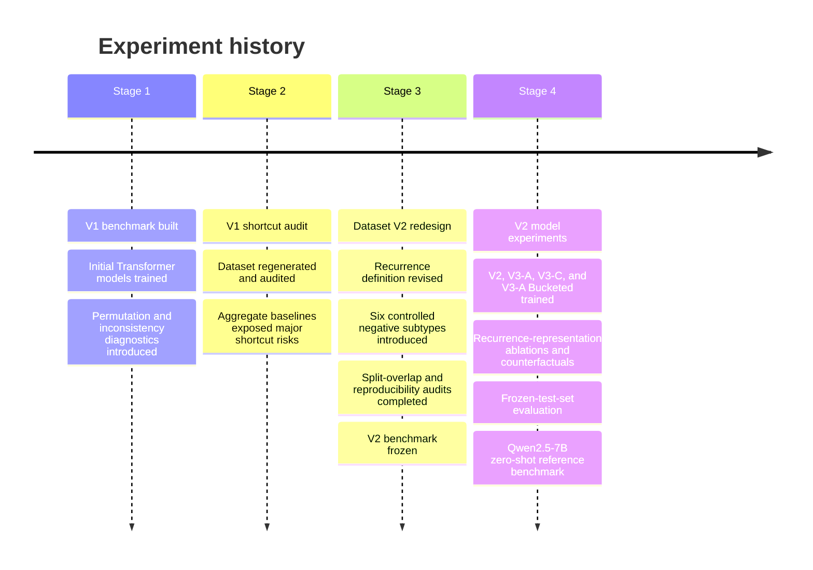

# Experiment History

The research project evolved through four major stages. Each stage is
documented according to the benchmark, models, and evidence available at that
point.

The version boundaries are kept explicit because results from the original V1
benchmark are not directly comparable with results from the final V2
benchmark.

---

## Stage 1 — V1: Original benchmark and initial modeling

The first benchmark was constructed from shared, long per-user event
timelines.

A typical user timeline covered approximately 120 days and was divided into
25-event windows using stride-1 sliding windows. Most negative examples came
from a separate control-user population.

An initial Transformer-based model was trained on this benchmark.

At this stage, the model showed non-trivial predictive performance, but
permutation and inconsistency diagnostics raised an important methodological
question:

> Was the model learning the intended recurrence structure, or was the
> benchmark providing simpler signals that were sufficient for prediction?

This question motivated a structured audit rather than treating the initial
model performance as evidence of recurrence detection.

---

# Stage 2 — V1 audit: quantifying shortcut risks

The original benchmark was regenerated from its own generation code into a
separate scratch directory and evaluated with targeted diagnostic baselines.

The audit identified several concrete problems.

| Finding                                                                 |           V1 measurement |
| ----------------------------------------------------------------------- | -----------------------: |
| Positive windows containing only one true occurrence                    |                **54.6%** |
| Negatives originating from the separate control-user population         | approximately **66–80%** |
| `cat_entropy` alone, test ROC-AUC                                       |                **0.819** |
| `cat_entropy` restricted to pattern users                               |   approximately **0.65** |
| Selected windows overlapping another selected window from the same user |  approximately **97.7%** |
| Hard negative subtypes as a share of all negatives                      |                 **≤11%** |
| Timing + category baseline, ROC-AUC                                     |                **0.883** |
| Category-set leakage relations across pattern splits                    |                    **7** |

The audit showed that V1 could be substantially separated using information
that did not require modeling the intended recurrence structure.

In particular, the positive-label construction did not reliably require
multiple recurrence sites, while the control-user population introduced a
strong population-level distinction between positive and negative examples.

The resulting methodological conclusion was:

> Good predictive performance on V1 did not establish that the model was
> reasoning about recurrence.

This became the primary motivation for redesigning the benchmark.

---

# Stage 3 — Dataset V2: benchmark redesign

Dataset V2 was rebuilt from scratch rather than modifying V1 incrementally.

The redesign addressed the specific shortcut risks identified during the
audit.

### Recurrence definition

A positive example now requires at least two temporally separated recurrence
sites of the same ordered category tuple.

Each site must satisfy the within-site timing constraint, and consecutive sites
must satisfy the temporal separation rule defined in
[`problem_definition.md`](problem_definition.md).

This directly removes the V1 failure mode in which a positive example could
contain only one occurrence.

### Negative construction

V2 introduces six explicit negative subtypes:

* `timing_matched`
* `order_permutation`
* `boundary_single_occurrence`
* `category_identity`
* `boundary_tight_burst`
* `pure_background`

Each subtype targets a different superficial similarity between positive and
negative windows.

This replaced the V1 setup in which a large fraction of negatives came from
an easily distinguishable control-user population.

### Split isolation

The V2 pattern pools were split with stronger isolation constraints.

The final audit found:

* zero user overlap;
* zero exact pattern-tuple overlap;
* zero category-set overlap, including equal, subset, and superset relations;
* balanced 50/50 class composition across train, validation, and test;
* maximum negative-subtype share of 22%.

### Reproducibility

The final V2 dataset was regenerated byte-for-byte from the recorded
generation configuration.

Train-derived temporal normalization statistics were also checked against the
stored evaluation statistics to float32 precision.

The benchmark was then frozen for the final model experiments.

### Effect on the aggregate shortcut baseline

The redesign reduced, but did not eliminate, the predictive information
available to a timing/category-only model.

| Metric                         |                       V1 |                     V2 |
| ------------------------------ | -----------------------: | ---------------------: |
| Timing + category ROC-AUC      |                **0.883** |        **0.807–0.809** |
| `cat_entropy` alone            |                **0.819** | approximately **0.68** |
| Maximum negative-subtype share | approximately **70–80%** |                **22%** |
| Category-set leakage relations |                    **7** |                  **0** |

The exact baseline values differ slightly across independent V2 runs because
of the evaluation implementation/configuration history; the final reported
comparison uses the frozen-test evaluation documented in
[`evaluation.md`](evaluation.md).

The important result of the redesign is therefore not that shortcut
information disappeared, but that the benchmark became substantially less
dependent on the most obvious V1 confounds.

---

# Stage 4 — V2 model experiments and final evaluation

The final experimental stage used the frozen V2 benchmark and included
multiple neural variants rather than a single model comparison.

## Model variants

### V2

The V2 model introduced the temporal-relation architecture and the continuous
recurrence representation.

Its training protocol also included the auxiliary objectives introduced for
the V2 experiment.

### V3-A

V3-A retained the temporal architecture while adding a learned event-order
embedding.

### V3-C

V3-C was designed as a controlled ablation of V3-A.

It uses the same architecture and training protocol as V3-A, with the learned
event-order embedding removed.

### V3-A Bucketed Recurrence

The bucketed variant replaced the continuous recurrence representation with
fixed recurrence-gap buckets while retaining the broader V3-A architecture.

This provided an additional test of how the representation of recurrence
timing affects model behavior.

---

## Final evaluation

The neural models and baseline were evaluated on the frozen V2 test set.

The final evaluation included:

* ROC-AUC and PR-AUC;
* official validation-selected threshold metrics;
* test-set best-F1 thresholds as diagnostics only;
* per-negative-subtype error analysis;
* recurrence-count analysis;
* recurrence-representation ablations;
* counterfactual interventions;
* independent zero-shot Qwen2.5-7B evaluation.

The main neural-model comparison and all primary test metrics are documented
in [`evaluation.md`](evaluation.md).

---

## Recurrence-representation ablations

The final stage also tested how strongly the neural models depended on their
recurrence-specific representations.

Two main interventions were used.

### No-prior representation

The explicit same-category recurrence representation was replaced with a
no-prior representation without retraining the model.

This caused substantial ranking degradation:

| Model | Original ROC-AUC | No-prior ROC-AUC |
| ----- | ---------------: | ---------------: |
| V2    |           0.7470 |           0.4012 |
| V3-A  |           0.7738 |           0.6520 |
| V3-C  |           0.7698 |           0.6526 |

### Global recurrence-feature permutation

The event-level alignment of recurrence features was disrupted through a
global permutation.

For the continuous models:

| Model | Original ROC-AUC | Permuted ROC-AUC |
| ----- | ---------------: | ---------------: |
| V2    |           0.7470 |           0.4882 |
| V3-A  |           0.7738 |           0.5142 |
| V3-C  |           0.7698 |           0.5508 |

For the bucketed model, globally permuting the recurrence buckets reduced
ROC-AUC from **0.7756 to 0.6278**.

These interventions show that the trained models rely substantially on the
recurrence representations supplied to them and, for the continuous models,
on their event-level alignment.

They do not by themselves establish that the models have learned a validated
or psychologically meaningful concept of behavioral recurrence.

---

# Independent LLM reference experiment

The final stage also included a separate zero-shot benchmark using
Qwen2.5-7B on the same frozen V2 test set.

The experiment used:

* one fixed prompt;
* no task-specific fine-tuning;
* no training on the benchmark;
* the same frozen test examples used for the model evaluation.

The result is treated as a single model-and-prompt reference point rather than
as a general statement about LLMs.

The detailed result and interpretation are reported in
[`evaluation.md`](evaluation.md).

---

# Explicit version boundaries

To prevent results from different benchmark versions from being mixed:

* **V1 results** refer only to the original benchmark and its Stage 2 audit.
* **V2 dataset statistics** refer to the frozen benchmark generated and audited
  during Stage 3.
* **V2, V3-A, V3-C, and V3-A Bucketed test results** refer to Stage 4's frozen
  V2 test set and final evaluation pipeline.
* **Qwen2.5-7B results** refer to the independent Stage 4 zero-shot experiment
  on that same frozen V2 test set.
* **V1 and V2 performance numbers are not treated as directly comparable
  model benchmarks**, because the underlying datasets and label construction
  differ.
* **Best-test-F1 thresholds are diagnostic values**, not primary evaluation
  results, because they use the frozen test labels.

No V1 result is used as evidence for performance on V2.

No V2 result is retroactively attributed to the V1 benchmark.

This separation is maintained throughout the research documentation so that
the benchmark redesign itself remains part of the experimental history rather
than being hidden behind the final model results.
