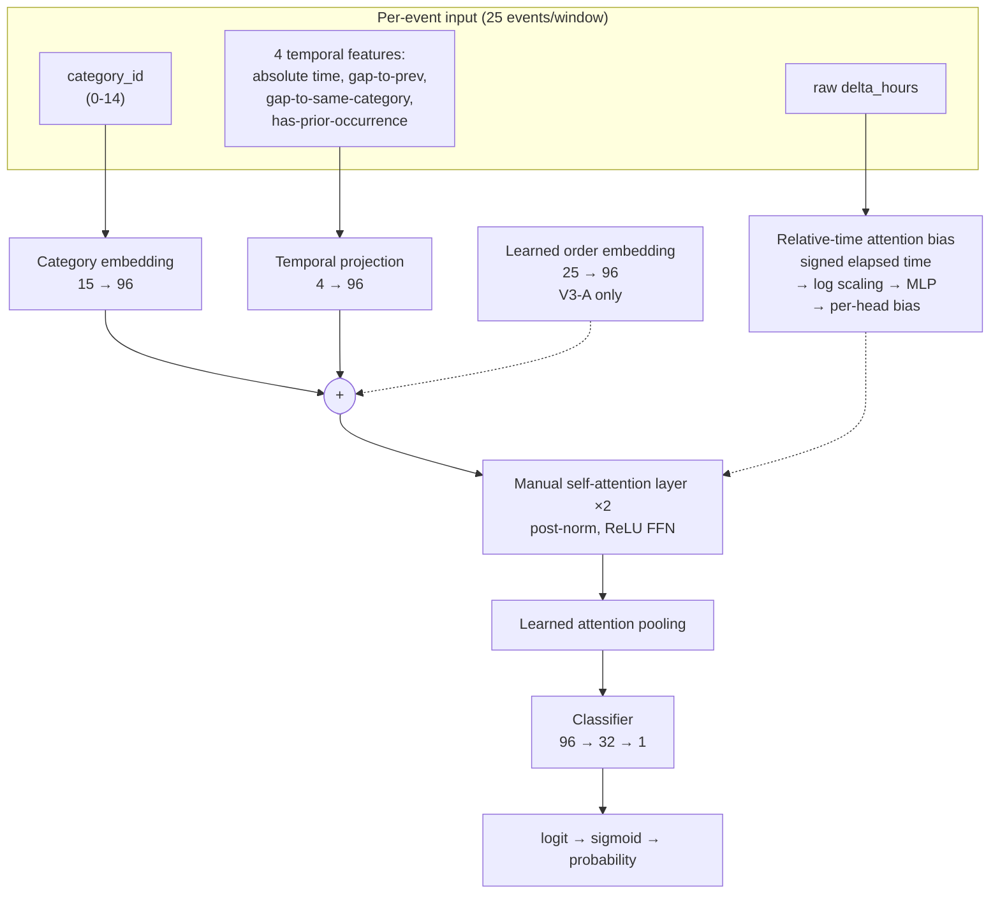

# Methodology

## Overview

The research module evaluates whether sequence models can identify an operational
notion of behavioral recurrence in synthetic 25-event windows, while controlling
for simpler timing and category-based explanations.

The evaluation uses four neural model variants, a deliberately simple
feature-engineered baseline, and a set of controlled ablations and
counterfactual interventions.

The main neural variants are:

* **V2** — temporal-relation Transformer using continuous recurrence features.
* **V3-A** — V2-style architecture with an additional learned event-order embedding.
* **V3-C** — controlled ablation of V3-A with the learned order embedding removed.
* **V3-A Bucketed Recurrence** — V3-A-style model using fixed recurrence-gap
  buckets instead of the continuous same-category recurrence representation.

The models are evaluated on the frozen V2 benchmark. V1 is an earlier model and
is reported separately because it was trained and evaluated on an earlier
benchmark with known shortcut issues.

---

## Baseline: timing + category gradient boosting

A deliberately simple feature-engineered classifier is used as the primary
non-sequential baseline.

Its purpose is twofold:

1. provide a low-complexity reference for the neural models; and
2. test how much of the benchmark can be explained by aggregate timing and
   category statistics without modeling event sequences.

### Features

For each 25-event window, the baseline receives only aggregate statistics.

**Timing features**

* total window duration
* mean, median, standard deviation, minimum, and maximum event gaps
* counts of gaps below several thresholds from 0.5h to 24h

**Category features**

* count of each of the 15 categories
* number of unique categories
* maximum single-category count
* Shannon entropy of the category distribution

The baseline does **not** receive event order, site identity, or a learned
sequence representation.

### Model and protocol

The classifier is:

`HistGradientBoostingClassifier`

with:

* 300 iterations
* learning rate = 0.05
* `random_state = 0`

It is fitted on the training split only. The classification threshold is
selected by maximizing F1 on the validation split and then applied unchanged
to the frozen test split.

Because the feature set is order-invariant, the model cannot directly
represent event order. Its near-zero response to the order-permutation
counterfactual is therefore an expected sanity check rather than evidence of
learned order sensitivity.

---

# Neural model family

The neural models operate directly on the ordered sequence of 25 events.

All V2-family models use:

* category embeddings
* temporal features
* learned relative-time attention
* two self-attention layers
* learned attention pooling
* a small binary classification head

The variants differ in how recurrence and order information are represented.

---

## V2: temporal-relation Transformer

V2 is the first model trained on the redesigned V2 benchmark.

Each event is represented using:

1. a categorical embedding;
2. four temporal features;
3. a learned relative-time attention bias.

The four temporal features are:

* normalized absolute event time;
* normalized gap to the immediately preceding event;
* normalized gap to the most recent prior event of the same category;
* a binary indicator specifying whether a prior same-category event exists.

The third feature is particularly relevant to the benchmark's recurrence
definition because it explicitly represents how long it has been since the
same category last occurred.

The V2 model does not use a learned absolute event-order embedding.

Its training protocol additionally includes the ranking/reordering auxiliary
objectives used in the V2 experiment. These objectives are part of the V2
training setup and are **not** used by V3-A or V3-C.

---

## V3-A and V3-C: controlled order-embedding ablation

V3-A and V3-C use the same underlying architecture and training protocol.
The intended difference is a single architectural component:

* **V3-A:** includes a learned event-order embedding.
* **V3-C:** removes that embedding.

This makes V3-C a controlled ablation of V3-A rather than an independently
designed alternative architecture.

### Shared components

| Component                         | V3-A | V3-C |
| --------------------------------- | ---: | ---: |
| Category embedding (15 → 96)      |    ✓ |    ✓ |
| Temporal projection (4 → 96)      |    ✓ |    ✓ |
| Learned order embedding (25 → 96) |    ✓ |    — |
| Relative-time attention bias      |    ✓ |    ✓ |
| Self-attention layers             |    2 |    2 |
| Learned attention pooling         |    ✓ |    ✓ |
| Classifier head                   |    ✓ |    ✓ |

The order embedding contains `25 × 96 = 2,400` trainable parameters. Apart
from this component, V3-A and V3-C use the same architecture and training
configuration.

---

## V3-A Bucketed Recurrence

The bucketed variant tests a coarser representation of recurrence timing.

Instead of representing the same-category recurrence interval entirely through
the continuous recurrence features, the model receives a learned embedding for
one of seven fixed recurrence-gap buckets:

| Bucket     | Definition                             |
| ---------- | -------------------------------------- |
| `NO_PRIOR` | no previous occurrence of the category |
| `0–6h`     | previous occurrence within 6 hours     |
| `6–24h`    | 6–24 hours                             |
| `24–72h`   | 24–72 hours                            |
| `72–168h`  | 3–7 days                               |
| `168–336h` | 7–14 days                              |
| `>336h`    | more than 14 days                      |

The bucketed model retains the main V3-A components, including the learned
event-order embedding, relative-time attention bias, attention layers,
pooling, and classifier.

This is an architectural representation experiment rather than a separate
benchmark.

---

# Shared neural architecture

## Category representation

Each event's category ID is mapped to a learned 96-dimensional embedding.

With 15 categories, the category embedding contains:

`15 × 96 = 1,440`

trainable parameters.

## Temporal representation

Temporal features are projected into the same 96-dimensional model space
through a learned linear projection.

The continuous representation includes information about both absolute time
and event-to-event recurrence relationships.

## Relative-time attention bias

In addition to the event representations, the models use a learned
pairwise temporal bias.

For every pair of events `(i, j)`, the signed elapsed time is transformed
using a signed logarithmic scaling:

`sign(Δt) × log(1 + |Δt|)`

The transformed value is passed through a small MLP to produce an additive
attention-logit bias for each attention head.

This provides the attention mechanism with a learned representation of
relative temporal distance without relying on conventional fixed sinusoidal
positional encoding.

The bias is shared across the self-attention layers.

---

## Why a custom attention implementation is used

An earlier implementation used PyTorch's
`nn.TransformerEncoder` and supplied the learned relative-time bias as an
attention mask.

During validation, this produced `NaN` losses while training remained finite.

The issue was traced to PyTorch's optimized TransformerEncoder execution path,
which can use a fused fast path during evaluation. That path did not behave
reliably with the arbitrary per-head additive attention bias used by this
model.

The implementation was therefore replaced with an explicit attention layer
built from standard PyTorch operations:

* linear projections
* matrix multiplication
* softmax
* dropout
* residual connections
* layer normalization
* feed-forward layers

This keeps the attention computation explicit and avoids having training and
evaluation depend on different internal attention execution paths.

The custom implementation preserves the intended post-normalization,
ReLU-feedforward architecture while making the temporal attention bias
explicitly controllable.

---

# Training protocols

The V2 and V3-family models are intentionally distinguished because their
training objectives are not identical.

## V2 training

V2 uses the temporal-relation architecture together with the auxiliary
training objectives introduced in the V2 experiment, including the
reordering/ranking-related objectives.

These objectives were designed to encourage sensitivity to temporal and
sequence structure.

## V3-A / V3-C training

V3-A and V3-C use the same training protocol so that the architectural
comparison remains controlled.

| Setting                   | V3-A / V3-C                   |
| ------------------------- | ----------------------------- |
| Seed                      | 42                            |
| Batch size                | 64                            |
| Optimizer                 | AdamW                         |
| Learning rate             | 5 × 10⁻⁵                      |
| Weight decay              | 0.01                          |
| Schedule                  | cosine with 10% linear warmup |
| Schedule step             | every batch                   |
| Loss                      | `BCEWithLogitsLoss`           |
| Ranking loss              | none                          |
| Reordering auxiliary loss | none                          |
| Data augmentation         | none                          |
| Maximum epochs            | 40                            |
| Early-stopping patience   | 8                             |

The classification threshold is selected from validation predictions at each
checkpoint by sweeping the range 0.10–0.90 in increments of 0.05.

A checkpoint is retained when validation F1 improves.

### Best validation checkpoints

| Model         | Best epoch | Validation F1 | Validation threshold | Precision | Recall |
| ------------- | ---------: | ------------: | -------------------: | --------: | -----: |
| V3-A          |         33 |        0.7576 |                 0.45 |    0.6873 | 0.8440 |
| V3-C          |         29 |        0.7686 |                 0.40 |    0.6696 | 0.9020 |
| V3-A Bucketed |         34 |        0.7716 |                 0.45 |         — |      — |

The stored validation metrics and thresholds are reproduced by the final
evaluation pipeline. The evaluation code independently recomputes validation
predictions and verifies the stored threshold rather than treating checkpoint
metadata as the sole source of truth.

---

# Evaluation and ablation methodology

The final evaluation uses the frozen V2 test set for all V2-family models.

The primary ranking metrics are:

* ROC-AUC
* PR-AUC

Threshold-dependent metrics are reported separately:

* F1
* precision
* recall
* accuracy

The official classification threshold is the threshold selected on the
validation set and stored with the checkpoint.

A separate **best-test-F1 threshold** is sometimes reported as a diagnostic.
It is selected using the test labels and therefore must not be treated as a
primary generalization metric.

---

## Recurrence-representation ablations

Two interventions are used to determine how strongly model predictions depend
on recurrence-specific information.

### Option A — no-prior representation

The continuous same-category recurrence representation is replaced by a
no-prior representation.

This intervention asks whether the model retains its predictive ranking when
the explicit event-level recurrence information is removed.

It is evaluated without retraining the model.

### Option B — global recurrence-feature permutation

For the continuous V2-family models, the pair

`(gap_same_category_norm, has_prev_same_category)`

is globally shuffled across test events using a fixed random seed.

The category sequence, ordinary temporal features, and labels remain unchanged.

This preserves the marginal distribution of the recurrence features while
destroying their original event-level alignment.

For the bucketed model, the analogous intervention globally shuffles the
recurrence bucket IDs.

Because the bucketed intervention operates on a discrete representation while
the continuous models operate on a feature pair, the two interventions are
reported separately rather than treated as perfectly identical experiments.

---

## Counterfactual analysis

Counterfactual tests modify individual properties of genuine positive windows
while keeping the remaining sequence as stable as possible.

The current analysis includes:

* order permutation
* timestamp collapse
* category identity substitution

The purpose is to measure output sensitivity to specific controlled changes,
not to establish causal understanding.

For order permutation in particular, a near-zero response from the aggregate
baseline is expected because its features are invariant to event order.

A model showing a non-zero response to an intervention is not, by itself,
evidence that the model has learned the intended behavioral concept; the
intervention must also be interpreted in relation to benchmark construction,
alternative shortcuts, and overall test performance.

---

# Recurrence-count analysis

Positive examples are additionally stratified by the number of intended
recurrence sites.

This analysis asks whether model predictions vary systematically with the
number of recurrence sites represented in a positive window.

It is treated as a descriptive analysis only.

An increasing score or recall with recurrence count does not demonstrate that
the model has learned recurrence itself, because the number of recurrence
sites can correlate with simpler timing and frequency statistics.

---

# Negative-subtype analysis

The V2 benchmark contains multiple negative constructions designed to isolate
different failure modes:

* `timing_matched`
* `order_permutation`
* `boundary_single_occurrence`
* `category_identity`
* `boundary_tight_burst`
* `pure_background`

Performance is therefore analyzed both globally and by negative subtype.

This is important because aggregate F1 or ROC-AUC can conceal large differences
in false-positive behavior across negative constructions.

The subtype analysis is descriptive and is not treated as an independent
validation benchmark.

---

# Reproducibility and audit controls

The final pipeline uses several controls to reduce accidental differences
between training and evaluation:

* fixed random seeds;
* frozen train/validation/test JSONL files;
* train-derived temporal normalization statistics;
* checkpoint-stored validation thresholds;
* independent recomputation of evaluation metrics;
* separate test-set diagnostics rather than test-tuned primary metrics;
* dataset regeneration checks;
* user-overlap checks;
* pattern-tuple and category-set overlap checks;
* verification of recurrence-feature normalization statistics;
* fixed seeds for counterfactual and permutation interventions.

The V2 dataset was regenerated byte-for-byte from the recorded generation
configuration, and the reported audit found no user overlap or pattern-tuple
overlap across splits.

These controls support reproducibility of the benchmark and experiments, but
they do not establish that the synthetic benchmark is representative of
real-world behavioral data.

---

# V1 as historical methodology

V1 used an earlier Transformer architecture and an earlier benchmark
construction.

It is retained for methodological history because its evaluation exposed
important shortcut risks in the original dataset.

The V1 benchmark contained measurable differences that could be exploited
without learning the intended recurrence concept. The subsequent V2 redesign
therefore introduced stronger separation and harder negative constructions.

V1 results should consequently be interpreted as **historical development
results**, not as directly comparable performance numbers for the final V2
benchmark.

---

# Methodological scope

The methodology evaluates a narrowly defined operational task on synthetic
longitudinal event windows.

It does **not** provide a validated detector of psychological traits,
behavioral disorders, or real-world social behavior.

The experiments can establish properties of the implemented models on the
constructed benchmark—for example, whether predictions change when specific
recurrence features are removed or permuted—but they cannot by themselves
establish that the model has discovered a psychologically meaningful notion
of recurrence.

The research module therefore remains an offline experimental component of
Socia and is not used by the production application to infer user behavior or
generate Journeys.
