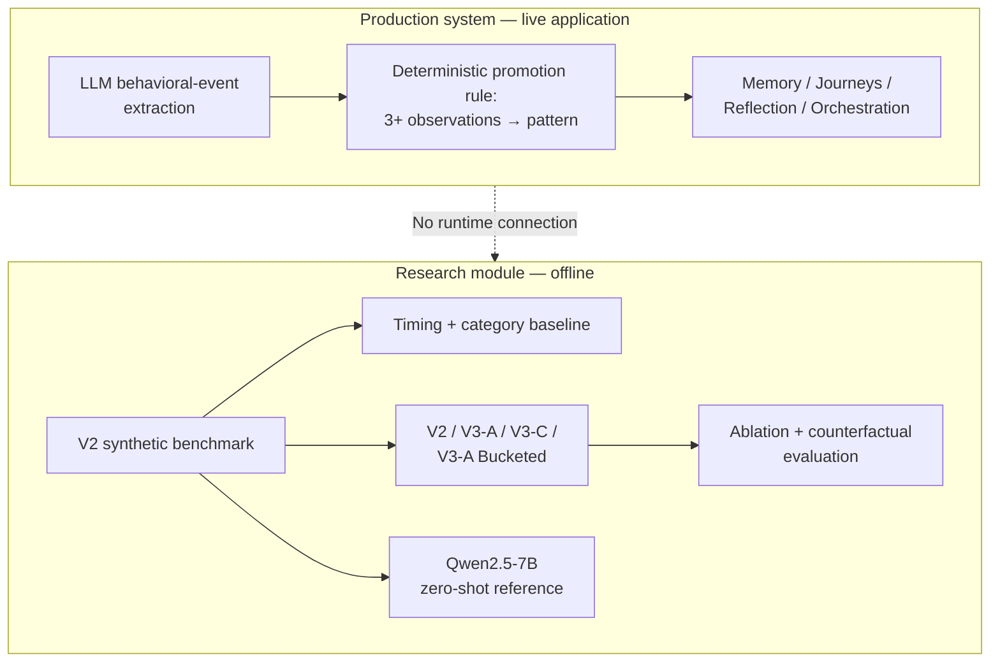

# Problem Definition

## Context

Socia is a conversational companion system with two conceptually separate
parts:

* **Production core**: an LLM extracts structured behavioral events from
  conversation. These observations feed memory, journeys, and reflection/
  orchestration. A deterministic application rule currently promotes a
  repeated observation group to a user-visible "pattern" after **3 or more
  observations**.
* **Research core** (this module): an independent offline investigation
  into whether sequence models can identify an operationally defined form
  of temporal recurrence in behavioral-event sequences.

These two parts are **not integrated**.

The research models do not run in production, do not influence the current
3+-observation rule, and do not generate user-facing patterns.

The research benchmark is also deliberately narrower than Socia's
production notion of a "behavioral pattern": it defines recurrence using
explicit temporal and category-level rules in a synthetic dataset.

See [Research vs. Production boundary](#research-vs-production-boundary)
below.

---

## Research question

> Given a 25-event window from a longitudinal behavioral-event stream, can
> a model distinguish an operationally defined recurring pattern from
> sequences that are superficially similar in timing, category
> composition, or event order but do not satisfy the benchmark's
> recurrence definition?

The question is intentionally narrower than:

> "Can Socia detect behavioral patterns?"

The project initially used a broader formulation and a first-generation
benchmark (V1). A structured audit showed that V1 contained several
shortcuts through which a model could obtain strong performance without
requiring the recurrence reasoning implied by the original framing.

The benchmark was therefore redesigned as V2 to make recurrence more
explicitly controlled and to introduce targeted negative examples.

The current research should consequently be understood as an investigation
of **recurrence detection under a controlled synthetic definition**, not as
a validated behavioral detector.

---

## What "recurrence" means in this benchmark

Recurrence is an **operational dataset definition**. It is not a
psychological or clinical definition of behavioral recurrence.

A sequence is labeled **positive** if and only if it contains at least
two temporally separated occurrences ("sites") of the same ordered
category tuple.

Each tuple contains **2–4 categories**.

For an occurrence/site to be valid:

1. Its categories must appear in the canonical order defined by the
   generator.
2. All events belonging to that occurrence must fall within a **24-hour
   burst span**.

For consecutive recurrence sites, the temporal separation must satisfy
both:

* an absolute gap of at least **2 days**, and
* a gap of at least **3× the burst span** of that particular pair.

The second condition makes the separation scale-relative rather than
depending only on a fixed global time window.

Formally, if two consecutive sites have burst span \(B_i\) and temporal
gap \(G_i\), they satisfy the recurrence-separation condition when:

$$
G_i \geq 2\text{ days}
$$

and

$$
G_i \geq 3B_i
$$

This definition is enforced by the dataset generator rather than inferred
after model evaluation.

---

## What is explicitly not recurrence?

Several boundary cases are deliberately excluded from the positive class.

### Single occurrence

A sequence containing exactly one well-formed occurrence of the tuple is
not positive.

These examples are represented by the:

`boundary_single_occurrence`

negative subtype.

### Tight burst

Two occurrences that are too close together to satisfy the persistence
condition are not considered temporally recurring under this benchmark.

These examples are represented by:

`boundary_tight_burst`

This distinction is important because repeated events within a single dense
episode are not equivalent to temporally separated recurrence under the
benchmark definition.

Other negative subtypes test different potential shortcuts; see
[`dataset.md`](dataset.md).

---

## Why recurrence is difficult to isolate

A sequence can contain information that correlates with a recurrence label
without actually containing the recurrence structure defined above.

The benchmark therefore attempts to separate several potentially
confounding signals.

### Timing and density

A sequence containing a dense burst of structured events can have timing
statistics that resemble a recurrence-positive example without containing
multiple temporally separated sites.

### Category composition

A window can contain the same categories as a recurring pattern without
containing repeated occurrences of that pattern.

This creates a distinction between:

* category presence/counts, and
* recurrence of an ordered category tuple.

### Frequency

A category occurring many times does not necessarily mean that a
multi-category pattern recurs.

For example, repeated instances of one category are not equivalent to
repeated sites of the same ordered tuple.

### Event order

The same category composition and similar timing can be arranged
differently.

A permutation of the event order is therefore treated separately from a
valid recurrence under the benchmark definition.

---

## Why the benchmark was redesigned

The original V1 benchmark was intentionally exploratory.

Its subsequent audit identified several sources of shortcut information,
including:

* approximately 54.6% of positive windows containing only one intended
  recurrence;
* substantial negative examples originating from a separate control-user
  population;
* strong performance from aggregate category/timing features;
* extensive overlap between selected windows;
* category-set relationships that could provide shortcut information.

These findings meant that good V1 performance could not be interpreted
cleanly as evidence of recurrence detection.

V2 was therefore redesigned to address these issues through:

* explicit multi-site positive construction;
* temporally separated recurrence sites;
* dedicated boundary negatives;
* multiple hard-negative subtypes;
* zero user overlap across splits;
* zero pattern-tuple overlap across splits;
* zero category-set overlap across splits;
* balanced train/validation/test classes;
* controlled negative-subtype proportions.

The V2 redesign should be described as **reducing identified benchmark
shortcuts**, not as proving that all possible shortcuts have been
eliminated.

See [`experiments.md`](experiments.md) and [`dataset.md`](dataset.md).

---

## Negative classes

The current V2 benchmark contains six deliberately constructed negative
subtypes:

| Subtype                      | Purpose                                                      |
| ---------------------------- | ------------------------------------------------------------ |
| `timing_matched`             | Tests whether similar timing alone is sufficient             |
| `order_permutation`          | Tests sequences with altered internal order                  |
| `boundary_single_occurrence` | Separates one valid occurrence from recurrence               |
| `category_identity`          | Tests category-composition / identity shortcuts              |
| `boundary_tight_burst`       | Separates dense bursts from temporally persistent recurrence |
| `pure_background`            | Provides non-pattern background sequences                    |

These negative types are not intended to represent every possible
non-recurring sequence. They are controlled benchmark interventions
designed around the specific shortcut hypotheses being studied.

---

## What the research is actually evaluating

The research evaluates several progressively modified sequence models:

* **V2** — temporal-relation Transformer;
* **V3-A** — V2-style recurrence representation plus learned event-order
  embedding;
* **V3-C** — controlled V3-A ablation without the learned event-order
  embedding;
* **V3-A Bucketed** — V3-A using discrete recurrence-gap buckets.

A separate **timing + category gradient-boosting baseline** is used to
determine how much performance can be obtained without explicit sequence
modeling.

The research also includes:

* recurrence-representation ablations;
* recurrence-feature permutation;
* counterfactual transformations;
* recurrence-count analysis;
* negative-subtype/error analysis;
* a separate zero-shot Qwen2.5-7B benchmark.

The baseline is important because a neural model performing well is not by
itself evidence that it has learned recurrence-specific structure.

---

## Research interpretation boundary

The benchmark allows us to ask whether model predictions change when
recurrence-related inputs are removed or disrupted.

For example, the current ablation experiments show substantial drops in
ranking performance when recurrence-related representations are replaced
or globally permuted.

This provides evidence that the trained models **depend on those
representations**.

However, this does not establish that the models have learned:

* a psychologically validated concept of behavioral recurrence;
* a causal representation of recurrence;
* semantic understanding of human behavior;
* a general-purpose behavioral pattern detector.

The synthetic benchmark itself defines what counts as recurrence.

Therefore the strongest supported interpretation is:

> The models learn to use recurrence-related representations that are
> predictive under the controlled synthetic benchmark, while real-world
> behavioral validity and generalization remain unestablished.

---

## Explicit non-goals

This research module does **not**:

* diagnose or claim to detect social anxiety, depression, ADHD, or any
  other clinical or psychological condition;
* claim to detect or understand real human behavior;
* establish that a user's real-world behavior follows the synthetic
  recurrence definition;
* claim that the current models are clinically validated;
* claim that the neural models outperform the timing + category baseline;
* claim that recurrence-feature ablations prove causal understanding;
* represent, feed, or influence Socia's production pattern-detection rule;
* generalize a single zero-shot Qwen2.5-7B result to LLMs as a category.

---

## Research vs. Production boundary

The production and research systems share a conceptual motivation but are
technically separate.

### Component boundaries

| Component                        | Function                                                      | Environment      |
| -------------------------------- | ------------------------------------------------------------- | ---------------- |
| LLM signal extraction            | Converts conversation into structured behavioral observations | Production       |
| Deterministic 3+ rule            | Promotes repeated observations to a production pattern        | Production       |
| V2 synthetic benchmark           | Defines and generates the controlled recurrence task          | Research         |
| Timing + category baseline       | Measures performance from aggregate features                  | Offline research |
| V2 / V3-A / V3-C                 | Sequence-model experiments                                    | Offline research |
| V3-A Bucketed                    | Discrete recurrence-representation experiment                 | Offline research |
| Ablation/counterfactual analysis | Tests model dependence and output sensitivity                 | Offline research |
| Qwen2.5-7B benchmark             | One zero-shot LLM reference experiment                        | Offline research |

The research module currently has **no effect on production predictions,
memory, journeys, or user-visible pattern generation**.

---

## Relationship to the production 3+ rule

The production rule and the research benchmark solve related but different
problems.

The production rule answers a simple application question:

> Has this observation been seen at least three times?

The research benchmark asks a more structured sequence question:

> Does this 25-event window contain at least two temporally separated
> occurrences of the same ordered category tuple under the benchmark's
> recurrence definition?

Therefore the research benchmark should not be described as a direct
evaluation of whether the production rule is "wrong" or "correct."

Instead, the fixed-count rule provides the practical motivation for
investigating whether a more sequence-aware approach could eventually
represent recurrence more explicitly.

---

## Current status

The research module is an **offline proof-of-concept / experimental
benchmarking pipeline**.

The current evidence establishes that:

* the V2 benchmark is reproducible and audited against several known
  leakage/shortcut risks;
* a simple timing + category baseline remains highly competitive;
* neural models exhibit substantial dependence on their recurrence-related
  representations;
* the current counterfactual experiments do not establish reliable
  order sensitivity;
* the zero-shot Qwen2.5-7B experiment should be interpreted only as a
  single-model reference result.

It does **not** establish real-world behavioral validity.

Future integration into Socia would require additional validation,
particularly on appropriate real longitudinal data, before the research
models could reasonably be considered for production use.
